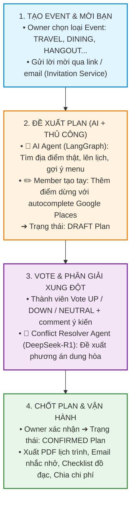

# 🚀 Project Overview — Nền Tảng Lên Kế Hoạch Nhóm Tích Hợp AI Multi-Agent

> [!NOTE]
> **Tóm Tắt Dự Án (Elevator Pitch)**: Group Plan AI là nền tảng web giúp các nhóm bạn và gia đình lên kế hoạch & chốt nhanh mọi hoạt động chung — từ chuyến du lịch nhiều ngày, bữa tối nhóm, buổi cafe chiều thứ 7, đến các hoạt động giải trí cuối tuần (karaoke, bowling, tham quan). Hệ thống kết hợp cơ chế bình chọn công khai cùng đội ngũ trợ lý AI Multi-Agent (LangGraph Python + DeepSeek API) để tự động hóa việc tìm địa điểm thật, lên lộ trình tối ưu, gợi ý menu/món ăn, tính chi phí và phân giải xung đột ý kiến.

---

## 💔 1. Nỗi Đau Thực Tế (Real-World Pain Points)

Khi một nhóm từ 3 đến 10 người muốn tổ chức một hoạt động cùng nhau, họ luôn gặp phải 4 vấn đề lớn:

| Nỗi đau | Biểu hiện thực tế | Hậu quả |
|---|---|---|
| 💬 **Tranh cãi vô tận & Trôi tin nhắn** | *"Tối nay ăn gì?"*, *"Cuối tuần đi đâu chơi?"* dẫn đến hàng trăm tin nhắn trên Zalo/Messenger. | Hàng giờ trôi qua mà nhóm không chốt được địa điểm. |
| 🎒 **Gánh nặng "Trưởng nhóm"** | Chỉ 1 người phải tự tìm địa điểm, xem review, lên lịch trình, hỏi từng người. | Người làm mệt mỏi, dễ bị trách móc nếu nhóm không vừa ý. |
| ⚡ **Xung đột ý kiến & Vote hòa** | Người thích đồ Nhật, người thích đồ Việt; vote phân tán mỗi người 1 ý. | Nhóm rơi vào bế tắc và dễ rơi vào tình trạng "hủy kèo". |
| 📍 **Thiếu thông tin chi tiết** | Chọn quán ăn không biết menu/giá; đi chơi không biết giá vé/giờ mở cửa. | Phát sinh chi phí ngoài dự kiến, di chuyển tốn thời gian. |

---

## 💡 2. Giải Pháp Của Hệ Thống (Our Solution)

Dự án áp dụng luồng nghiệp vụ **Event → Plan → Vote → Confirm** minh bạch, kết hợp giữa sự chủ động của con người và năng lực tính toán của AI Multi-Agent:

---

## ⭐ 3. Điểm Độc Đáo & Ưu Thế Kỹ Thuật (Core Differentiators)

### 🌟 3.1. Đa Dạng Loại Sự Kiện (Multi-EventType)
Không chỉ giới hạn ở use-case "du lịch 3-5 ngày", hệ thống phục vụ **mọi nhu cầu sinh hoạt nhóm thường ngày**:

> [!TIP]
> **Tự động thay đổi tiêu chí tìm kiếm theo danh mục**: Với sự kiện `DINING`, AI tự động tìm nhà hàng & gợi ý menu món ăn; với `ENTERTAINMENT`, AI tra cứu giá vé & khung giờ chơi; với `SIGHTSEEING`, AI kiểm tra giờ mở cửa & tips tham quan.

| EventType | Ví dụ thực tế | AI Trợ lý làm gì khác biệt? |
|---|---|---|
| ✈️ `TRAVEL` | Du lịch Đà Lạt 3N2Đ, Phú Quốc 4N3Đ | Tìm khách sạn → xếp tuyến đường tham quan theo ngày → tính ngân sách |
| 🍜 `DINING` | "Tối thứ 7 ăn gì?" (Nhóm 5 người) | Tìm nhà hàng → **gợi ý menu/món ăn đặc sắc** → tính giá trung bình/người |
| ☕ `HANGOUT` | Cafe chiều thứ 7 | Tìm quán cafe theo vibe (rooftop, yên tĩnh, sống ảo) → chọn giờ mượt |
| 🎳 `ENTERTAINMENT` | Karaoke, bowling, escape room | Tìm chỗ chơi → **tra cứu giá vé/khung giờ** → gợi ý đặt chỗ |
| 🏛️ `SIGHTSEEING` | Tham quan bảo tàng, di tích, check-in | Tìm điểm check-in → giờ mở cửa, giá vé, tips gửi xe |
| 🎈 `CUSTOM` | Teambuilding, sinh nhật, picnic | User tự do thêm hoạt động, AI đóng vai trò trợ lý hỏi đáp |

---

### 🧠 3.2. Chiến Lược Mô Hình AI Kép (DeepSeek Dual-Model Strategy)
Tối ưu hóa chi phí và tốc độ suy luận bằng cách phân công 2 mô hình LLM chuyên biệt:

- **`deepseek-chat` (DeepSeek-V3)**: Đảm nhận 80% tác vụ hội thoại tự do, phân loại `eventType`, phân tích ý định (Intent Classification), gọi công cụ (Function Calling) tra cứu thời tiết, địa điểm. Tốc độ siêu nhanh, chi phí rất rẻ.
- **`deepseek-reasoner` (DeepSeek-R1)**: Đảm nhận các tác vụ tư duy sâu (Reasoning Tokens): lên lịch trình tối ưu thời gian di chuyển, cân đối ngân sách, phân tích phản hồi vote của từng thành viên để dung hòa xung đột.

---

### 🐍 3.3. Đồng Bộ 100% Python Ecosystem (FastAPI + LangGraph Python)
- **Backend FastAPI**: Tốc độ cao, async/await native, tự động sinh OpenAPI spec (`/docs`).
- **LangGraph Python**: AI Agents chạy trực tiếp trong mã nguồn Backend, chia sẻ chung SQLAlchemy DB Models & Pydantic Schemas mà không cần qua IPC hay REST API trung gian giữa 2 ngôn ngữ.

---

### 🤝 3.4. Nguyên Tắc Human-in-the-Loop
> [!IMPORTANT]
> AI **không bao giờ tự ý chốt quyết định thay con người**. AI chỉ đóng vai trò người cố vấn tạo ra bản nháp (`DRAFT`). Con người vote và **chỉ Owner của Event mới có quyền bấm CONFIRM** chuyển sang kế hoạch chính thức.

---

## 🎯 4. Phạm Vi Dự Án (Scope of Work)

### 🟢 Trong phạm vi MVP (Hoàn thành trong 4 Sprint)
- **Auth & Identity**: Đăng ký, đăng nhập Google/Facebook OAuth2, JWT access/refresh token rotation, quên mật khẩu, hồ sơ cá nhân.
- **Event & Member Management**: Tạo Event theo 6 loại (`EventType`), mời bạn bè qua link/email (`Invitation`), phân quyền Owner / Member / Viewer.
- **Plan & Vote Engine**: Tạo plan thủ công (drag & drop, autocomplete Google Places) và plan AI. Luồng vote công khai (UP/DOWN/NEUTRAL + comment), chuyển trạng thái DRAFT → VOTING → CONFIRMED.
- **Data Lookup & Redis Caching**: Gọi Google Places API (lọc theo `StopCategory`: RESTAURANT, CAFE, ENTERTAINMENT, ATTRACTION, HOTEL), OpenWeatherMap, Tỷ giá tiền tệ, cache Redis.
- **AI Multi-Agent System**: Đội ngũ 9 Agents (Orchestrator, Location, Research, Plan, Booking, Note, Cost, Conflict Resolver, Chat Agent) chạy trên LangGraph Python & DeepSeek API. Realtime streaming qua SSE/WebSockets.
- **Utility Services**: Gửi email thông báo (SMTP), xuất PDF lịch trình (WeasyPrint), checklist đồ đạc, tính toán chia chi phí nhóm.
- **Admin Dashboard**: Thống kê số lượng user, event, token usage DeepSeek, cache hit rate.

### 🔴 Mở rộng tương lai (Backlog sau MVP)
- Đăng tải & tham khảo Plan công khai từ cộng đồng (#13).
- Gói tài khoản Premium giới hạn lượt dùng AI (#10).
- Tích hợp thanh toán trực tiếp cho đặt phòng / đặt bàn.

---

## 👥 5. Mô Hình Phân Công 6 Thành Viên (6-Track Execution)

| Track | Thành viên | Vai trò & Trách nhiệm | File task chi tiết |
|---|---|---|---|
| **BE-Core / AI Tooling** | **Tạ Quang Huy** | Backend Dev A (Core Domain: Schema DB gốc, Auth, Event, Plan, Vote, Invitations) & AI Agent Tooling Integration | [person-1-backend-core.md](../04-tasks/person-1-backend-core.md) |
| **BE-Platform / FE-Core** | **Hà Đăng Huy** | Backend Dev B (Places/Weather API, Redis Cache) & Frontend Dev A (UI Auth, Event Dashboard, Plan Builder, Vote UI) | [person-2-backend-platform.md](../04-tasks/person-2-backend-platform.md) / [person-4-frontend-core.md](../04-tasks/person-4-frontend-core.md) |
| **BE-Services** | **Phạm Đình Ánh Dương** | Backend Dev C (Email Notifications SMTP, PDF Export WeasyPrint, Realtime WS/SSE Server, Admin APIs) | [person-2-backend-platform.md](../04-tasks/person-2-backend-platform.md) |
| **FE-Growth** | **Nguyễn Minh Đức** | Frontend Dev B (Realtime AI Chat UI, Landing Page, i18n, Shared Expenses UI, Admin UI) | [person-5-frontend-growth.md](../04-tasks/person-5-frontend-growth.md) |
| **AI Lead** | **Nguyễn Tùng Dương** | AI Agent Lead (LangGraph Architecture, 9 Sub-Agents, DeepSeek V3/R1 integration, Reasoning Engine) | [person-3-ai-engineer.md](../04-tasks/person-3-ai-engineer.md) |
| **DevOps & Security** | **Đinh Tiến Luân** | Cyber Security & DevOps (Docker Compose, CI/CD GitHub Actions, FastAPI Security, Pentest OWASP) | [person-6-security-devops.md](../04-tasks/person-6-security-devops.md) |

---

## 📊 6. Chỉ Số Thành Công Đánh Giá (Key Performance Indicators)

1. ⏱️ **Thời gian chốt plan nhóm**: Giảm từ 2-3 ngày tranh cãi xuống dưới **15 phút**.
2. 🎯 **Tỷ lệ chấp nhận đề xuất AI**: ≥ 70% các điểm dừng do Plan Agent đề xuất được giữ lại trong bản plan cuối.
3. 🤝 **Độ chính xác phân giải xung đột**: Conflict Resolver Agent giải quyết thành công ≥ 80% các trường hợp vote hòa.
4. ⚡ **Hiệu năng hệ thống**: Thời gian phản hồi API tra cứu địa điểm < 200ms (Redis cache); AI Chat streaming token đầu < 1.5s.
