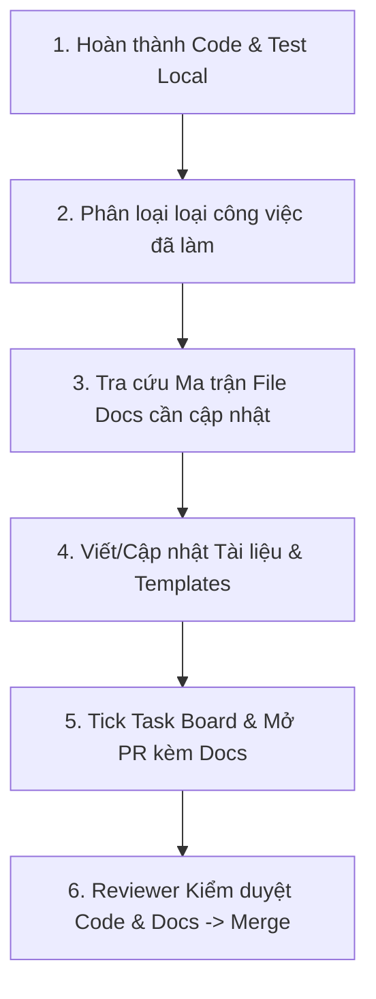

# 📝 Quy Trình Viết Tài Liệu Sau Khi Hoàn Thành Task (Post-Task Documentation Workflow)

> **Mục tiêu**: Đảm bảo toàn bộ hệ thống tài liệu trong `/docs` luôn đồng bộ 100% với mã nguồn thực tế. Triển khai triệt để nguyên tắc **"Docs-as-Code"** — Mỗi task chỉ được coi là **ĐÃ HOÀN THÀNH (DONE)** khi mã nguồn, unit test và tài liệu liên quan đều được cập nhật hoàn chỉnh trong cùng một Pull Request.

---

## 1. Triết Lý & Nguyên Tắc Cốt Lõi (Core Principles)

1. **No Docs = Not Done (Chưa có Docs = Chưa Xong Task)**:
   Code chạy đúng và pass test mới chỉ là 50% công việc. 50% còn lại là cập nhật tài liệu để 5 thành viên còn lại trong team nắm được thay đổi và không bị block.
2. **Cập nhật cùng PR (Atomic Pull Requests)**:
   Tài liệu và code **phải nằm trong cùng một PR**. Tuyệt đối không mở PR code trước rồi hứa "viết docs sau" (vì thực tế sẽ quên hoặc làm trôi thông tin).
3. **Thật chi tiết & Có cấu trúc (High Precision & Structured)**:
   Mọi tài liệu phải chỉ rõ: *thay đổi cái gì*, *ở file nào*, *cách dùng ra sao*, kèm ví dụ request/response hoặc sơ đồ minh họa.
4. **Tránh Nợ Tri Thức (Anti-Knowledge Debt)**:
   Khi làm việc song song (3 BE, 2 FE, 2 AI, 1 DevOps), tài liệu sống (Living Documentation) là hợp đồng duy nhất giữ cho các thành viên chạy đúng hướng.

---

## 2. Quy Trình 5 Bước Thực Hiện Sau Mỗi Task (Step-by-Step Workflow)



### Bước 1: Kiểm tra kết quả Code & Test local
- Đã chạy lint (`ruff check .` hoặc `pnpm run lint`) không có lỗi.
- Đã chạy unit test (`pytest` hoặc `pnpm run test`) pass 100%.

### Bước 2: Phân loại loại công việc vừa thực hiện
Xác định task của bạn thuộc loại nào bên dưới để biết cần cập nhật những tài liệu gì:
- **Loại A**: Hoàn thành task tính năng / API / UI cá nhân theo phân công.
- **Loại B**: Thêm mới hoặc chỉnh sửa REST API Endpoint / Data Schema / Response Format.
- **Loại C**: Thay đổi Cơ sở dữ liệu (DB Schema / Model SQLAlchemy / Migration Alembic).
- **Loại D**: Cập nhật AI Agent (LangGraph node, Prompt template, Tool calling, Model R1/V3).
- **Loại E**: Thay đổi kiến trúc, thư viện cốt lõi, hoặc quyết định kỹ thuật lớn (ADR).
- **Loại F**: Cập nhật Biến môi trường (`.env`), Docker Compose, scripts deployment.
- **Loại G**: Sửa bug quan trọng (Bug fix / Hotfix / Edge case).

### Bước 3: Tra cứu Ma trận vị trí file tài liệu (Document Location Matrix)
*(Xem chi tiết bảng tra cứu tại [Mục 3](#3-ma-trận-vị-trí-file-tài-liệu-document-location-matrix))*

### Bước 4: Viết và Cập nhật Tài liệu theo mẫu chuẩn
- Tiến hành chỉnh sửa các file `.md` liên quan trực tiếp trong repo.
- Sử dụng các mẫu template sẵn có ở [Mục 4](#4-hướng-dẫn-cách-viết-chi-tiết--template-mẫu-writing-guidelines--templates).

### Bước 5: Cập nhật Task Board, tạo PR & Nộp Review
- Tick `[x]` hoàn thành mã task trên file nhiệm vụ cá nhân (`docs/04-tasks/person-X-*.md`) và master task board (`docs/TASKS.md`).
- Khi mở Pull Request bằng `.github/PULL_REQUEST_TEMPLATE.md`, **điền bắt buộc** danh sách các file docs đã cập nhật vào phần *Updated Docs*.
- Tag Reviewer phụ trách module. PR sẽ bị reject nếu thiếu tài liệu cập nhật.

---

## 3. Ma Trận Vị Trí File Tài Liệu (Document Location Matrix)

Dưới đây là bảng tra cứu chính xác **file tài liệu nào cần cập nhật** dựa trên loại công việc:

| Loại thay đổi (Task Type) | Vị trí File Cần Cập Nhật / Tạo Mới | Nội dung bắt buộc phải bổ sung / chỉnh sửa |
|---|---|---|
| **Cập nhật Tiến độ Task Cá nhân** | [docs/04-tasks/person-X-*.md](file:///D:/LT/Group_Project/docs/04-tasks/)<br>[docs/TASKS.md](file:///D:/LT/Group_Project/docs/TASKS.md) | - Chuyển `[ ] TASK-xxx` thành `[x] TASK-xxx`.<br>- Điền link PR / commit hash và ngày hoàn thành. |
| **Thêm / Sửa REST API Endpoint (Backend)** | [docs/02-standards/api-design-guide.md](file:///D:/LT/Group_Project/docs/02-standards/api-design-guide.md)<br>[backend/README.md](file:///D:/LT/Group_Project/backend/README.md)<br>Docstring trong Router (FastAPI Swagger) | - Cập nhật REST Endpoint Spec (URL Path, HTTP Method, Auth Guard, Request Body, Response Schema, Error Codes).<br>- Viết Google-style docstring trong controller/service. |
| **Thay đổi DB Schema / Model SQLAlchemy** | [docs/03-architecture/database-schema.md](file:///D:/LT/Group_Project/docs/03-architecture/database-schema.md) | - Cập nhật bảng định nghĩa columns, data types, indexes, foreign keys.<br>- Bổ sung file migration Alembic tương ứng vào `backend/alembic/versions/`.<br>- Cập nhật sơ đồ Mermaid ERD nếu có bảng/mối quan hệ mới. |
| **Cập nhật AI Agent / Prompt / Tools** | [docs/03-architecture/ai-agent-architecture.md](file:///D:/LT/Group_Project/docs/03-architecture/ai-agent-architecture.md)<br>[explain.md](file:///D:/LT/Group_Project/explain.md) | - Mô tả state graph node mới, router condition mới trong LangGraph.<br>- Cập nhật danh sách tools, input/output JSON schema của tool.<br>- Cập nhật cấu hình prompt & model (`deepseek-chat` V3 / `deepseek-reasoner` R1). |
| **Thay đổi / Thêm tính năng UI (Frontend)** | [docs/04-tasks/person-4-frontend-core.md](file:///D:/LT/Group_Project/docs/04-tasks/person-4-frontend-core.md)<br>hoặc [person-5-frontend-growth.md](file:///D:/LT/Group_Project/docs/04-tasks/person-5-frontend-growth.md)<br>[frontend/README.md](file:///D:/LT/Group_Project/frontend/README.md) | - Mô tả component mới, route URL mới (`/events/:id/plan`).<br>- Cập nhật MSW Mock Handlers trong `frontend/src/mocks/handlers.ts`. |
| **Quyết định Kỹ thuật / Kiến trúc lớn (ADR)** | `docs/03-architecture/adr/ADR-xxx-ten-quyet-dinh.md`<br>[docs/03-architecture/system-architecture.md](file:///D:/LT/Group_Project/docs/03-architecture/system-architecture.md) | - Tạo file ADR mới theo đúng template (ADR-001, ADR-002...).<br>- Cập nhật sơ đồ hệ thống tổng thể nếu có thêm Service / Broker / Cache layer. |
| **Thay đổi Biến Môi Trường / Config / Docker** | [.env.example](file:///D:/LT/Group_Project/.env.example)<br>[docs/05-security/security-guidelines.md](file:///D:/LT/Group_Project/docs/05-security/security-guidelines.md)<br>[README.md](file:///D:/LT/Group_Project/README.md) | - Bổ sung key mới vào `.env.example` kèm giá trị mẫu và ghi chú giải thích.<br>- Cập nhật lệnh hướng dẫn chạy trong `README.md` hoặc `docker-compose.yml`. |
| **Sửa Bug Phức Tạp / Edge Case** | Docstring trong Code + PR Description | - Viết comment giải thích "tại sao" chọn phương án sửa này trong code.<br>- Mô tả chi tiết nguyên nhân gốc (root cause) và cách khắc phục trong PR Description. |
| **Cập nhật Quy trình / Standard chung** | [docs/01-workflow/](file:///D:/LT/Group_Project/docs/01-workflow/)<br>[docs/02-standards/](file:///D:/LT/Group_Project/docs/02-standards/) | - Cập nhật file workflow hoặc coding standard tương ứng. |

### Cấu trúc Thư mục Tài liệu Dự án (`/docs`)

```
Group_Project/
├── README.md                      # Mục lục & Hướng dẫn khởi chạy tổng
├── CONTRIBUTING.md                # Quy tắc đóng góp nhanh cho dev
├── guides.md                      # Lộ trình đọc tài liệu 15 phút theo vai trò
├── feature.md                     # Danh sách 42 tính năng chi tiết
├── explain.md                     # Luồng hoạt động thực tế & DeepSeek API
├── .env.example                   # Mẫu biến môi trường chuẩn
├── backend/
│   └── README.md                  # Hướng dẫn chạy & lệnh dev Backend (FastAPI)
├── frontend/
│   └── README.md                  # Hướng dẫn chạy & lệnh dev Frontend (React)
└── docs/
    ├── TASKS.md                   # Master Task Board (Tất cả micro-tasks & status)
    ├── 00-overview/               # Tổng quan dự án, RACI Matrix, Tech Stack
    ├── 01-workflow/               # QUY TRÌNH LÀM VIỆC (WORKFLOW)
    │   ├── post-task-documentation.md  # <--- [DOC NÀY] Quy trình viết docs sau task
    │   ├── git-workflow.md        # Mô hình branching & quy trình PR
    │   ├── contract-first-workflow.md # Cơ chế API Contract code song song
    │   ├── cross-team-collaboration.md # Phối hợp giữa các nhóm / Thêm tính năng
    │   ├── branch-naming.md       # Quy chuẩn đặt tên nhánh
    │   ├── commit-convention.md   # Quy chuẩn commit message
    │   └── code-review-checklist.md # Checklist review PR
    ├── 02-standards/              # TIÊU CHUẨN KỸ THUẬT (STANDARDS)
    │   ├── coding-conventions.md  # Style code Python FastAPI & React TS
    │   ├── naming-conventions.md  # Quy tắc đặt tên file, class, DB, variable
    │   ├── api-design-guide.md    # API Specs chi tiết (REST endpoints & Schema)
    │   ├── documentation-guide.md # Quy tắc format Markdown & Comment Code
    │   └── testing-guide.md       # Tiêu chuẩn viết Pytest / Vitest
    ├── 03-architecture/           # KIẾN TRÚC HỆ THỐNG
    │   ├── system-architecture.md # Sơ đồ tổng thể hệ thống
    │   ├── database-schema.md     # Chi tiết bảng dữ liệu & quan hệ ERD
    │   ├── ai-agent-architecture.md # LangGraph Multi-Agent Architecture
    │   └── adr/                   # Architecture Decision Records (ADR-001...)
    ├── 04-tasks/                  # PHÂN CHIA NHIỆM VỤ THEO NGƯỜI
    │   ├── task-board.md          # Bảng theo dõi tiến độ tổng hợp
    │   ├── person-1-backend-core.md
    │   ├── person-2-backend-platform.md
    │   ├── person-3-ai-engineer.md
    │   ├── person-4-frontend-core.md
    │   ├── person-5-frontend-growth.md
    │   └── person-6-security-devops.md
    └── 05-security/               # BẢO MẬT & DEVOPS
        └── security-guidelines.md # Checklist bảo mật & Pydantic sanitization
```

---

## 4. Hướng Dẫn Cách Viết Chi Tiết & Template Mẫu (Writing Guidelines & Templates)

### 4.1 Template 1: Cập Nhật Tiến Độ Task Cá Nhân (`docs/04-tasks/person-X-*.md` & `docs/TASKS.md`)
Khi hoàn thành một task, hãy cập nhật trạng thái ô check `[ ]` thành `[x]` và điền kèm thông tin PR:

```markdown
<!-- TRƯỚC KHIM SỬA -->
- [ ] **TASK-102**: Viết API `POST /api/v1/events` tạo sự kiện mới kèm Pydantic validation.

<!-- SAU KHI SỬA -->
- [x] **TASK-102**: Viết API `POST /api/v1/events` tạo sự kiện mới kèm Pydantic validation. *(PR #14 - @minhduc1212 - 14/08/2026)*
```

---

### 4.2 Template 2: Cập Nhật API Specification (`docs/02-standards/api-design-guide.md`)
Khi tạo mới hoặc sửa đổi REST API endpoint, bổ sung block sau vào phần tương ứng trong `api-design-guide.md`:

```markdown
### `POST /api/v1/events/{event_id}/plans`

- **Mô tả**: Tạo một kế hoạch (Plan) đề xuất mới thuộc sự kiện.
- **Phân quyền (Auth)**: Required (`Bearer JWT`). User phải có role `OWNER` hoặc `MEMBER` trong event.
- **Request Headers**:
  - `Content-Type: application/json`
  - `Authorization: Bearer <access_token>`

- **Request Body (JSON)**:
```json
{
  "title": "Kế hoạch khám phá Đà Lạt 3N2Đ",
  "event_type": "TRAVEL",
  "budget_estimated": 2500000,
  "note": "Ưu tiên chọn các địa điểm săn mây và quán cà phê đẹp"
}
```

- **Response Success `201 Created`**:
```json
{
  "code": 201,
  "message": "Plan created successfully",
  "data": {
    "id": "plan_99812",
    "event_id": "evt_12345",
    "title": "Kế hoạch khám phá Đà Lạt 3N2Đ",
    "event_type": "TRAVEL",
    "budget_estimated": 2500000,
    "status": "DRAFT",
    "is_ai_generated": false,
    "created_by": "usr_88219",
    "created_at": "2026-08-14T21:48:00Z"
  }
}
```

- **Response Error Codes**:
  - `401 Unauthorized`: Access token không hợp lệ hoặc đã hết hạn.
  - `403 Forbidden`: Người dùng không có quyền tạo plan trong sự kiện này.
  - `404 Not Found`: Không tìm thấy `event_id`.
  - `422 Unprocessable Entity`: Dữ liệu đầu vào sai format (VD: `budget_estimated < 0`).
```

---

### 4.3 Template 3: Cập Nhật DB Schema Spec (`docs/03-architecture/database-schema.md`)
Khi thêm bảng mới hoặc sửa đổi cột trong SQLAlchemy Model:

```markdown
#### Bảng `plan_votes` (Bình chọn cho điểm dừng / kế hoạch)

**Mô tả**: Lưu trữ lượt vote của các thành viên trong sự kiện cho từng điểm dừng.

| Tên Cột | Kiểu Dữ Liệu | Nullable | Mặc Định | Mô Tả / Ràng Buộc |
|---|---|---|---|---|
| `id` | `VARCHAR(36)` | NO | `UUID` | Khóa chính (Primary Key) |
| `plan_stop_id` | `VARCHAR(36)` | NO | Foreign Key | FK tới `plan_stops.id` (ON DELETE CASCADE) |
| `user_id` | `VARCHAR(36)` | NO | Foreign Key | FK tới `users.id` |
| `vote_type` | `VARCHAR(20)` | NO | `'UPVOTE'` | Kiểu vote: `'UPVOTE'`, `'DOWNVOTE'`, `'ABSENT'` |
| `created_at` | `TIMESTAMPTZ` | NO | `NOW()` | Thời gian thực hiện vote |

**Indexes & Constraints**:
- `UNIQUE(plan_stop_id, user_id)`: Mỗi user chỉ được vote 1 lần cho mỗi point stop.
- `INDEX idx_plan_votes_stop_id (plan_stop_id)`: Tối ưu query đếm tổng số vote.
```

---

### 4.4 Template 4: Tạo File Architecture Decision Record (ADR)
Lưu file mới tại `docs/03-architecture/adr/ADR-xxx-ten-quyet-dinh.md` (ví dụ: `ADR-003-redis-websocket-voting.md`):

```markdown
# ADR-003: Sử Dụng Redis Pub/Sub Kết Hợp WebSockets Cho Realtime Voting

- **Trạng thái**: Accepted
- **Ngày quyết định**: 2026-08-14
- **Tác giả / Người quyết định**: Tạ Quang Huy, Nguyễn Minh Đức

## 1. Bối cảnh (Context)
Khi nhiều thành viên cùng tham gia vote điểm dừng (PlanStop) trong thời gian thực, giao diện Frontend cần hiển thị kết quả bình chọn ngay lập tức mà không bắt người dùng phải reload trang hoặc poll HTTP API liên tục.

## 2. Các phương án đã cân nhắc (Options Considered)
1. **Phương án A: HTTP Long-Polling**
   - *Ưu điểm*: Dễ cài đặt.
   - *Nhược điểm*: Gây tải lớn lên server FastAPI khi có hàng trăm kết nối chờ, latency cao (2-5s).
2. **Phương án B: Server-Sent Events (SSE)**
   - *Ưu điểm*: Nhẹ, truyền 1 chiều tốt.
   - *Nhược điểm*: Không tối ưu khi về sau cần tương tác 2 chiều (báo trạng thái typing/presence).
3. **Phương án C: FastAPI WebSockets + Redis Pub/Sub (ĐƯỢC CHỌN)**
   - *Ưu điểm*: Tương tác 2 chiều mượt mà, latency < 50ms, Redis Pub/Sub giúp sync message giữa nhiều worker node của FastAPI.

## 3. Quyết định (Decision)
Chọn **Phương án C**: Xây dựng WebSocket Router tại `backend/app/api/v1/endpoints/ws.py` sử dụng Redis Pub/Sub channel `event:{event_id}:votes`.

## 4. Hệ quả & Đánh đổi (Consequences)
- **Tích cực**: Trải nghiệm UI mượt mà, phản hồi tức thì, giảm 80% số lượng request HTTP trùng lặp.
- **Thách thức**: Cần xử lý reconnect phía React client khi mất mạng & cần cấu hình thêm Redis container trong `docker-compose.yml`.
```

---

### 4.5 Template 5: Điền Bắt Buộc PR Description (`.github/PULL_REQUEST_TEMPLATE.md`)
Khi đẩy code và mở PR trên GitHub, bắt buộc điền chi tiết phần **Docs Updated**:

```markdown
## 📌 Thông tin PR
- **Mã Task**: TASK-108 (Backend Core)
- **Tên Task**: Thêm API Vote điểm dừng & WebSocket broadcast

## 📝 Các thay đổi chính (Summary of Changes)
- Thêm model SQLAlchemy `PlanVote` và migration file Alembic `v0.4_add_plan_votes.py`.
- Tạo API Controller `POST /api/v1/plans/{id}/stops/{stop_id}/vote`.
- Thêm WebSocket connection manager tích hợp Redis Pub/Sub.

## 📚 Danh sách Docs Đã Cập Nhật (Post-Task Docs Checklist)
- [x] `docs/04-tasks/person-1-backend-core.md` (Tick [x] TASK-108)
- [x] `docs/TASKS.md` (Update trạng thái TASK-108)
- [x] `docs/02-standards/api-design-guide.md` (Thêm REST API spec & WebSocket Event format)
- [x] `docs/03-architecture/database-schema.md` (Bổ sung bảng `plan_votes`)
- [x] `docs/03-architecture/adr/ADR-003-redis-websocket-voting.md` (Tạo file ADR mới)

## 🧪 Kết quả Kiểm thử (Verification)
- [x] Pytest pass 100%: `pytest tests/test_votes.py` (Coverage 94%)
- [x] Ruff lint clean: `ruff check .` không báo warning.
```

---

## 5. Quy Tắc Định Dạng & Tiêu Chuẩn Trình Bày (Formatting Guidelines)

1. **Chuẩn Markdown & Phân cấp H1-H4**:
   - Tiêu đề tuân thủ thứ tự `#` (H1) -> `##` (H2) -> `###` (H3). Không nhảy cấp.
   - Mọi khối lệnh code bắt buộc khai báo ngôn ngữ: ` ```python `, ` ```json `, ` ```ts `, ` ```bash `, ` ```sql `.
2. **Đường dẫn liên kết tương đối (Relative Links)**:
   - Tất cả đường dẫn liên kết giữa các file trong repo bắt buộc dùng relative path (ví dụ: `../02-standards/api-design-guide.md`), không dùng đường dẫn tuyệt đối hoặc URL domain cứng.
3. **Ngôn ngữ viết**:
   - **Tài liệu hướng dẫn, workflow, kiến trúc**: Viết bằng **Tiếng Việt** rõ ràng, chuẩn ngữ pháp, thuật ngữ kỹ thuật giữ nguyên từ tiếng Anh (như *JWT, Route, Middleware, Polling, WebSocket*).
   - **Comment trong code, Docstring, Commit message, PR Title, API Endpoint Path**: Viết bằng **Tiếng Anh**.
4. **Sơ đồ minh họa**:
   - Sử dụng khối code **Mermaid** (` ```mermaid `) để vẽ sơ đồ luồng/ERD trực tiếp trong file Markdown. Giúp Git có thể diff và theo dõi lịch sử thay đổi của sơ đồ theo thời gian.

---

## 6. Quy Trình Kiểm Duyệt PR của Reviewer (Docs Review Checklist)

Dành cho thành viên đảm nhận vai trò **Code Reviewer** trước khi bấm nút Merge PR:

- [ ] **1. Kiểm tra PR Description**: Tác giả PR có liệt kê các file docs đã cập nhật trong mục *Updated Docs* không?
- [ ] **2. Kiểm tra Diff Docs**: Mở tab *Files changed* trên PR, xác nhận có sự xuất hiện của các file `.md` tương ứng với thay đổi trong code.
- [ ] **3. Tính chính xác của Docs**:
  - Tên thuộc tính trong JSON Schema trong doc có khớp 100% với Pydantic Model / TypeScript Interface trong code không?
  - Status code (200, 201, 400, 403, 404, 422) có được liệt kê đầy đủ không?
- [ ] **4. Task Board Check**: Khối checklist trong `docs/04-tasks/person-X-*.md` và `docs/TASKS.md` đã được đổi sang `[x]` đúng mã task chưa?

> ⚠️ **Hành động khi vi phạm**: Nếu một PR có thay đổi logic/API/Schema nhưng **KHÔNG** cập nhật file doc tương ứng, Reviewer **bắt buộc reject PR** với comment:
> `[blocking] PR thiếu cập nhật tài liệu theo quy trình tại docs/01-workflow/post-task-documentation.md. Vui lòng bổ sung docs trước khi re-request review.`
