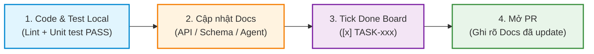

# 📝 Quy Trình Viết Tài Liệu Sau Khi Hoàn Thành Task (Post-Task Docs)

> **Nguyên tắc vàng**: **"No Docs = Not Done"** (Chưa có tài liệu = Chưa xong task).  
> Code và tài liệu **bắt buộc nằm chung một Pull Request (PR)**. PR thay đổi logic/API/Schema mà không cập nhật docs tương ứng sẽ bị từ chối (Reject).

---

## ⚡ 1. Tóm Tắt Nhanh Trong 30 Giây (Quick Cheatsheet)

Mỗi khi bạn code xong 1 task, chỉ cần làm đúng **4 bước**:

```
1. Test Local sạch sẽ   →  Chạy pytest / pnpm test & linter pass 100%.
2. Sửa File Docs        →  Tra bảng ở Mục 2 xem cần sửa file .md nào.
3. Tick Done Task Board →  Đổi [ ] thành [x] trong file task cá nhân & docs/TASKS.md.
4. Mở PR kèm Docs       →  Điền danh sách docs đã sửa vào PR Description.
```

---

## 🧭 2. Tôi Vừa Làm Gì ➔ Cần Sửa File Nào? (Tra Cứu Nhanh)

Xác định việc bạn vừa làm ở cột trái để biết chính xác file cần mở và sửa ở cột phải:

| Bạn vừa làm gì? | File tài liệu cần cập nhật | Nội dung cần ghi |
|---|---|---|
| ✅ **Hoàn thành bất kỳ task nào** | `docs/04-tasks/person-X-*.md`<br>`docs/TASKS.md` | Đổi `[ ] TASK-xxx` thành `[x] TASK-xxx` kèm link PR |
| 🔌 **Thêm / Sửa REST API Endpoint** | `docs/02-standards/api-design-guide.md` | Thêm URL, Method, Request Body, Response JSON, Error Codes |
| 🗄️ **Thêm / Sửa DB Schema / Model** | `docs/03-architecture/database-schema.md` | Thêm/sửa bảng, cột, kiểu dữ liệu, quan hệ FK, file migration Alembic |
| 🤖 **Sửa AI Agent / Prompt / Tools** | `docs/03-architecture/ai-agent-architecture.md`<br>`explain.md` | Thêm node LangGraph, Prompt mới, Tool schema, model V3/R1 |
| 🎨 **Thêm trang / component UI mới** | `docs/04-tasks/person-X-*.md`<br>`frontend/src/mocks/handlers/` | Mô tả component, route URL, cập nhật Mock MSW |
| 🔑 **Thêm biến môi trường / Config** | `.env.example`<br>`docs/05-security/security-guidelines.md` | Thêm key mới vào `.env.example` kèm giá trị mẫu |
| 💡 **Đưa ra quyết định kỹ thuật lớn** | `docs/03-architecture/adr/ADR-xxx.md` | Viết 1 file ADR mới giải thích lý do chọn giải pháp |

---

## 🔄 3. Chi Tiết 4 Bước Thực Hiện



### Bước 1: Test Local sạch sẽ
- **Backend**: `poetry run pytest` và `poetry run ruff check .`
- **Frontend**: `pnpm run test` và `pnpm run lint`

### Bước 2: Cập nhật tài liệu liên quan
Mở file tài liệu theo bảng ở **Mục 2** và cập nhật nội dung tương ứng (xem mẫu ở Mục 4).

### Bước 3: Đánh dấu hoàn thành trên Task Board
Mở file task cá nhân trong `docs/04-tasks/person-X-*.md` và `docs/TASKS.md`:
```markdown
<!-- Đổi từ: -->
- [ ] **TASK-102**: Viết API đăng ký user
<!-- Thành: -->
- [x] **TASK-102**: Viết API đăng ký user *(PR #12 - @ten_ban - 21/08/2026)*
```

### Bước 4: Mở PR và liệt kê tài liệu đã sửa
Trong phần mô tả PR trên GitHub, điền đầy đủ các file tài liệu bạn đã sửa vào mục **Updated Docs**.

---

## 📋 4. Các Mẫu Template Copy-Paste Nhanh

### 4.1. Mẫu ghi API Specification (`docs/02-standards/api-design-guide.md`)

```markdown
### `POST /api/v1/events/{event_id}/plans`

- **Mô tả**: Tạo kế hoạch mới cho sự kiện.
- **Quyền (Auth)**: `Bearer JWT` (Role: `OWNER` hoặc `MEMBER`).
- **Request Body (JSON)**:
```json
{
  "title": "Lịch trình Đà Lạt 3N2Đ",
  "budget_estimated": 2500000
}
```
- **Response `201 Created`**:
```json
{
  "success": true,
  "data": {
    "id": "plan_123",
    "event_id": "evt_456",
    "title": "Lịch trình Đà Lạt 3N2Đ",
    "status": "DRAFT"
  }
}
```
- **Error Codes**: `401 Unauthorized`, `403 Forbidden`, `404 Event Not Found`, `422 Validation Error`.
```

---

### 4.2. Mẫu ghi DB Schema (`docs/03-architecture/database-schema.md`)

```markdown
#### Bảng `plan_votes`

| Cột | Kiểu | Null | Mặc định | Ghi chú |
|---|---|---|---|---|
| `id` | `VARCHAR(36)` | NO | `UUID` | Khóa chính |
| `plan_id` | `VARCHAR(36)` | NO | FK | Khóa ngoại tới `plans.id` (CASCADE) |
| `user_id` | `VARCHAR(36)` | NO | FK | Khóa ngoại tới `users.id` |
| `value` | `VARCHAR(10)` | NO | - | `UP`, `DOWN`, `NEUTRAL` |
| `created_at` | `TIMESTAMPTZ` | NO | `NOW()` | Thời gian vote |

- **Ràng buộc**: `UNIQUE(plan_id, user_id)` (Mỗi người chỉ vote 1 lần / plan).
```

---

### 4.3. Mẫu quyết định kỹ thuật ADR (`docs/03-architecture/adr/ADR-xxx.md`)

```markdown
# ADR-003: Sử dụng WebSocket + Redis Pub/Sub cho Realtime Voting

- **Trạng thái**: Accepted
- **Người đề xuất**: Tạ Quang Huy, Nguyễn Minh Đức

## 1. Bối cảnh
Cần cập nhật kết quả bình chọn theo thời gian thực cho tất cả thành viên trong phòng.

## 2. Lựa chọn
- *HTTP Polling*: Dễ làm nhưng làm chậm server khi đông người.
- *WebSocket + Redis Pub/Sub (Chọn)*: Nhanh (<50ms), chịu tải tốt, hỗ trợ multi-instance.

## 3. Quyết định & Hệ quả
Dùng WebSocket Router tại `backend/app/api/v1/endpoints/ws.py` và kênh Redis `event:{id}:votes`.
```

---

### 4.4. Mẫu điền PR Description (`.github/PULL_REQUEST_TEMPLATE.md`)

```markdown
## 📌 Thông tin Task
- **Mã Task**: TASK-108
- **Mô tả**: Thêm API Vote điểm dừng & WebSocket broadcast

## 📚 Danh sách Docs Đã Cập Nhật (Bắt buộc)
- [x] `docs/04-tasks/person-1-backend-core.md` (Tick [x] TASK-108)
- [x] `docs/TASKS.md` (Tick [x] TASK-108)
- [x] `docs/02-standards/api-design-guide.md` (Thêm API POST /votes)
- [x] `docs/03-architecture/database-schema.md` (Thêm bảng plan_votes)

## 🧪 Kết quả Test
- [x] Unit test pass 100% (`pytest tests/test_votes.py`)
- [x] Lint clean (`ruff check .`)
```

---

## 🛡️ 5. Checklist Dành Cho Reviewer (Trước Khi Bấm Merge)

Khi review PR của đồng đội, kiểm tra 4 điều sau:

1. [ ] Có tick `[x]` trong file task cá nhân và `docs/TASKS.md` chưa?
2. [ ] PR Description có liệt kê danh sách các file Docs đã sửa không?
3. [ ] Nếu có sửa API / Database / Config, các file tài liệu tương ứng (`api-design-guide.md`, `database-schema.md`, `.env.example`) đã được sửa trong cùng PR chưa?
4. [ ] Kiểu dữ liệu trong docs có khớp 100% với code Pydantic / TypeScript không?

> ⚠️ **Quy tắc chặn (Blocking Rule)**: Nếu PR có sửa logic/API/DB mà **thiếu cập nhật docs**, Reviewer bấm **Request Changes** và từ chối merge cho đến khi docs được bổ sung.
