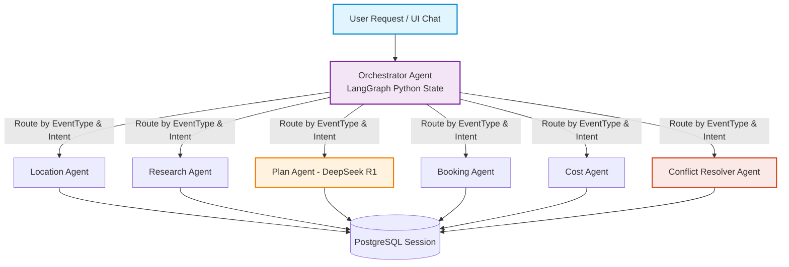
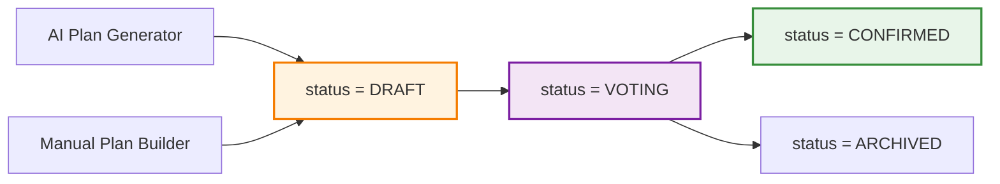

# AI Multi-Agent Architecture (Nhóm 4)

## 1. Tổng quan
Hệ thống dùng mô hình **Orchestrator–Worker** trên nền **LangGraph Python (`langgraph`)**: 1 agent điều phối (orchestrator) nhận yêu cầu, quyết định gọi sub-agent nào, tổng hợp kết quả trả về. Vì Backend viết bằng **Python FastAPI**, AI Agent chạy trực tiếp trong cùng môi trường Python, gọi `deepseek-chat` (V3) và `deepseek-reasoner` (R1) thông qua SDK chính thức.



`Note Agent` và `Chat Agent` hoạt động song song, Chat Agent sử dụng FastAPI WebSockets hoặc SSE (`EventSourceResponse`) để streaming câu trả lời.

## 1.1 Routing theo loại sự kiện (EventType)

Orchestrator nhận `eventType` từ context event và điều chỉnh chiến lược gọi sub-agent phù hợp:

| EventType | Luồng Agent chính | Ghi chú |
|---|---|---|
| `TRAVEL` | Location → Research → Plan → Booking → Cost | Luồng mặc định, lên lịch trình nhiều ngày |
| `DINING` | Location (filter: nhà hàng/quán ăn) → Research (menu, review) → Plan (chọn quán + giờ) → Booking (đặt bàn) | Gợi ý **món ăn** dựa trên sở thích nhóm, dị ứng, ngân sách |
| `HANGOUT` | Location (filter: cafe/bar) → Plan (chọn quán + giờ) | Luồng ngắn, ít bước |
| `ENTERTAINMENT` | Location (filter: khu vui chơi, karaoke, bowling...) → Research (giá vé, khung giờ) → Plan → Booking | Gợi ý hoạt động phù hợp số người, độ tuổi |
| `SIGHTSEEING` | Location (filter: bảo tàng, di tích, triển lãm) → Research (giờ mở cửa, giá vé, tips) → Plan → Cost | Tối ưu tuyến đường tham quan |
| `CUSTOM` | Chat Agent xử lý tự do, user tự thêm stop thủ công | Orchestrator ở chế độ trợ lý, không tự động generate full plan |

> **Lưu ý**: Location Agent dùng chung cho mọi loại sự kiện, nhưng nhận thêm tham số `category` filter (`StopCategory`: RESTAURANT, CAFE, ENTERTAINMENT, ATTRACTION...) để thu hẹp kết quả Google Places phù hợp context.

## 2. Vai trò từng Agent
| Agent | Input chính | Output | Ghi chú |
|---|---|---|---|
| Orchestrator | Yêu cầu người dùng (text/action) + context event | Quyết định route + tổng hợp kết quả | LangGraph Python state machine, `deepseek-chat` |
| Location Agent | Sở thích, ngân sách, khu vực, category filter | Danh sách địa điểm gợi ý | Gọi Google Places API qua `httpx`, có cache Redis |
| Research Agent | Địa điểm cụ thể | Thông tin chi tiết, review, **menu/món ăn** (DINING), giá vé (ENTERTAINMENT) | Có thể dùng RAG (`pgvector`) nếu có dữ liệu tích lũy |
| Plan Agent | Danh sách địa điểm + ràng buộc thời gian | Lịch trình theo ngày + ngân sách sơ bộ | Dùng `deepseek-reasoner` để tối ưu lộ trình |
| Booking Agent | Địa điểm/khách sạn đã chọn | Link đặt chỗ sẵn (không tự đặt hộ) | Chỉ đưa link, không thực hiện giao dịch thay user |
| Note Agent | Loại chuyến đi, thời tiết | Checklist/lưu ý khi đi chơi | Dùng data OpenWeatherMap |
| Conflict Resolver | Kết quả vote (nhiều ý kiến trái chiều) | Đề xuất phương án dung hoà | Dùng `deepseek-reasoner` phân tích lý do vote |
| Cost Agent | Danh sách stop + giá ước tính | Tổng chi phí, chia đều / chia theo món | Ưu tiên tính bằng Python code, LLM trích xuất giá từ text |
| Chat Agent | Hội thoại tự do của user | Trả lời + gọi tool tới agent khác | Expose qua `/api/v1/ai/chat`, dùng FastAPI SSE/WebSocket streaming |

## 3. State & Checkpoint (LangGraph Python)
- Dùng Pydantic `TypedDict` / `BaseModel` cho LangGraph state:
  ```python
  class AgentState(TypedDict):
      event_id: str
      event_type: str
      user_intent: str
      retrieved_places: list[dict]
      draft_plan: dict | None
      budget_constraint: float | None
      conversation_history: list[dict]
  ```
- Checkpoint bằng AsyncSqliteSaver / AsyncPostgresSaver theo `eventId` để lưu giữ ngữ cảnh hội thoại.

## 4. Vote & Confirm — áp dụng cho MỌI loại Plan

Luồng Vote → Confirm **áp dụng bình đẳng** cho cả Plan do AI tạo lẫn Plan tạo thủ công (#11):



### Quy tắc:
- **Mọi Plan** (dù AI hay thủ công) khi tạo đều có `status = DRAFT`.
- Người tạo plan (Owner hoặc Member) bấm **"Gửi cho nhóm vote"** → `status = VOTING` → notification tới tất cả member.
- Member vote (UP / DOWN / NEUTRAL) + comment góp ý.
- Nếu vote phân tán → Conflict Resolver Agent có thể được gọi để đề xuất dung hòa (chỉ áp dụng nếu user chọn nhờ AI hỗ trợ).
- **Chỉ Owner** mới có quyền xác nhận → `status = CONFIRMED`.
- AI **không tự động chốt plan cuối cùng** — AI hỗ trợ ra quyết định, **không thay quyền quyết định của người dùng**.

## 5. Bảo mật đầu vào (phối hợp Nhóm 1 + Nhóm 4)
- Mọi input tự do từ user qua Pydantic validation & bleach/sanitize trước khi đưa vào prompt.
- Dùng cấu trúc message role user/system tách biệt của DeepSeek API, không tự ghép chuỗi thô.
- Giới hạn độ dài input, giới hạn số bước trong LangGraph recursion_limit (đặt 15 bước, xem `AI_MAX_STEPS_PER_SESSION`).
- Output từ LLM được validate qua Pydantic schema trước khi lưu DB.

## 6. Theo dõi chi phí
- Mỗi lần gọi Agent ghi log vào bảng `agent_logs` (input/output tokens, duration_ms, agent_name).
- Admin Dashboard tổng hợp chi phí theo user/ngày để quản lý quota.
