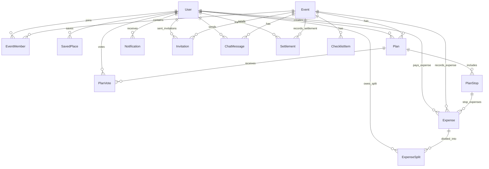

# Database Schema (Prisma / PostgreSQL)

> **Tài liệu chuẩn kiến trúc Database** cho dự án Web Lên Kế Hoạch Nhóm Tích Hợp AI Multi-Agent.
>
> ⚠️ **Quan trọng về ORM**: Schema trong tài liệu này được viết bằng **cú pháp Prisma** để dễ đọc, dễ thảo luận thiết kế trong Sprint 0. **Implementation thực tế dùng SQLAlchemy 2.0 / SQLModel (Async)** với Alembic migrations. Các khái niệm (model, relation, enum, index, constraint) giữ nguyên — chỉ khác cú pháp khai báo. Xem [naming-conventions.md](../02-standards/naming-conventions.md) mục 2 để biết convention SQLAlchemy/SQLModel cụ thể.
>
> **Cập nhật quan trọng (Tích hợp AI Cost Agent & Hệ thống Quản lý / Chia Tiền Chuyến Đi)**:
> Bổ sung toàn bộ hệ thống quản lý tài chính 3 giai đoạn: **Dự toán AI (Cost Agent)** $\rightarrow$ **Quỹ nhóm & Ghi nhận chi phí thực tế** $\rightarrow$ **AI Tự động Quyết toán & Bù trừ nợ tối ưu (Optimal Settlement)**.

---

## 1. Sơ đồ quan hệ chính (ERD)



---

## 2. Prisma Schema (Đầy đủ)

```prisma
datasource db {
  provider = "postgresql"
  url      = env("DATABASE_URL")
}

generator client {
  provider = "prisma-client-js"
}

// ==========================================
// 1. USER & AUTHENTICATION
// ==========================================

model User {
  id            String       @id @default(uuid())
  email         String       @unique
  passwordHash  String?      @map("password_hash")   // null nếu login qua OAuth
  fullName      String       @map("full_name")
  avatarUrl     String?      @map("avatar_url")
  provider      AuthProvider @default(LOCAL)
  role          SystemRole   @default(USER)        // Quyền hệ thống (USER/ADMIN)
  status        UserStatus   @default(ACTIVE)      // [CHƯA CODE]
  createdAt     DateTime     @default(now()) @map("created_at") // [CHƯA CODE]

  // Relations
  eventMembers        EventMember[]
  savedPlaces         SavedPlace[]            // [CHƯA CODE]
  createdPlans        Plan[]                  // [CHƯA CODE]
  notifications       Notification[]          // [CHƯA CODE]
  votedPlans          PlanVote[]              // [CHƯA CODE]
  sentInvitations     Invitation[]            @relation("InvitationsSent") // [CHƯA CODE]
  receivedInvitations Invitation[]            @relation("InvitationsReceived") // [CHƯA CODE]
  createdChecklistItems ChecklistItem[]         // [CHƯA CODE]
  chatMessages          ChatMessage[]           // [CHƯA CODE]
  
  // Financial Relations (Quản lý tài chính 3 bảng tối ưu)
  paidExpenses        Expense[]               @relation("ExpensesPaid") // [CHƯA CODE]
  expenseSplits       ExpenseSplit[]          // [CHƯA CODE]
  settlementsFrom     Settlement[]            @relation("SettlementsFrom") // [CHƯA CODE]
  settlementsTo       Settlement[]            @relation("SettlementsTo") // [CHƯA CODE]

  @@map("users")
}

enum AuthProvider {
  LOCAL
  GOOGLE
  FACEBOOK
}

enum SystemRole {
  USER
  ADMIN
}

enum UserStatus {
  ACTIVE
  SUSPENDED
}

// ==========================================
// 2. EVENT & MEMBERSHIP
// ==========================================

model Event {
  id          String    @id @default(uuid())
  name        String
  description String?
  type        EventType @default(TRAVEL)
  location    String?
  startDate   DateTime  @map("start_date")
  endDate     DateTime  @map("end_date")
  createdAt   DateTime  @default(now()) @map("created_at") // [CHƯA CODE]

  // Relations
  members           EventMember[]
  plans             Plan[]                    // [CHƯA CODE]
  invitations       Invitation[]              // [CHƯA CODE]
  checklistItems    ChecklistItem[]           // [CHƯA CODE]
  chatMessages      ChatMessage[]             // [CHƯA CODE]
  
  // Financial Relations
  expenses          Expense[]                 // [CHƯA CODE]
  settlements       Settlement[]              // [CHƯA CODE]

  @@map("events")
}

enum EventType {
  TRAVEL        // Chuyến du lịch (nhiều ngày, lên lịch trình)
  DINING        // Đi ăn / chọn quán / chọn món
  HANGOUT       // Cafe, bar, gặp mặt nhẹ
  ENTERTAINMENT // Chỗ chơi: karaoke, bowling, escape room, arcade...
  SIGHTSEEING   // Tham quan: bảo tàng, triển lãm, di tích, check-in
  CUSTOM        // Tự định nghĩa (teambuilding, sinh nhật, ...)
}

model EventMember {
  id       String    @id @default(uuid())
  eventId  String    @map("event_id")
  userId   String    @map("user_id")
  role     EventRole @default(MEMBER)
  joinedAt DateTime  @default(now()) @map("joined_at") // [CHƯA CODE]

  event    Event     @relation(fields: [eventId], references: [id], onDelete: Cascade)
  user     User      @relation(fields: [userId], references: [id], onDelete: Cascade)

  @@unique([eventId, userId])
  @@map("event_members")
}

enum EventRole {
  OWNER
  MEMBER
  VIEWER
}

// ==========================================
// 3. PLAN & ITINERARY (AI DỰ TOÁN CHI PHÍ)
// ==========================================


model Plan {
  id            String     @id @default(uuid())
  eventId       String     @map("event_id")
  title         String
  status        PlanStatus @default(DRAFT)          // [CHƯA CODE]
  isAiGenerated Boolean    @default(false) @map("is_ai_generated")
  totalBudget   Decimal?   @map("total_budget")   // AI Cost Agent ghi tổng dự toán ngân sách
  createdById   String?    @map("created_by_id")
  createdAt     DateTime   @default(now()) @map("created_at") // [CHƯA CODE]

  event         Event      @relation(fields: [eventId], references: [id], onDelete: Cascade) // [CHƯA CODE]
  createdBy     User?      @relation(fields: [createdById], references: [id], onDelete: SetNull) // [CHƯA CODE]
  stops         PlanStop[]
  votes         PlanVote[]                          // [CHƯA CODE]

  @@map("plans")
}

enum PlanStatus {
  DRAFT        // AI đề xuất, chưa chốt
  VOTING
  CONFIRMED
  ARCHIVED
}

model PlanStop {
  id              String        @id @default(uuid())
  planId          String        @map("plan_id")
  order           Int
  placeName       String        @map("place_name")
  placeRefId      String?       @map("place_ref_id")
  lat             Float?
  lng             Float?
  note            String?
  estimatedCost   Decimal?      @map("estimated_cost") // AI Cost Agent dự tính tiền trước cho điểm này
  category        StopCategory?
  startTime       DateTime?     @map("start_time")
  durationMinutes Int?          @map("duration_minutes")
  metadata        Json?

  plan            Plan          @relation(fields: [planId], references: [id], onDelete: Cascade)
  expenses        Expense[]     // [CHƯA CODE] Liên kết các chi phí thực tế phát sinh tại điểm dừng này

  @@map("plan_stops")
}

enum StopCategory {
  ATTRACTION    // Điểm tham quan, check-in
  RESTAURANT    // Nhà hàng, quán ăn
  CAFE          // Quán cafe
  HOTEL         // Khách sạn, homestay
  ENTERTAINMENT // Khu vui chơi, karaoke, bowling
  TRANSPORT     // Di chuyển (sân bay, xe cộ)
  SHOPPING      // Mua sắm
  OTHER         // Khác
}

model PlanVote {
  id        String    @id @default(uuid())
  planId    String    @map("plan_id")
  userId    String    @map("user_id")
  value     VoteValue
  comment   String?
  createdAt DateTime  @default(now()) @map("created_at")

  plan      Plan      @relation(fields: [planId], references: [id], onDelete: Cascade)
  user      User      @relation(fields: [userId], references: [id], onDelete: Cascade)

  @@unique([planId, userId])
  @@map("plan_votes")
}

enum VoteValue {
  UP
  DOWN
  NEUTRAL
}

// ==========================================
// 4. QUẢN LÝ TÀI CHÍNH (CẤU TRÚC 3 BẢNG TỐI ƯU)
// ==========================================

// Bảng 1: Ghi nhận mọi giao dịch (Thu quỹ & Chi tiêu thật)
model Expense {
  id          String        @id @default(uuid())
  eventId     String        @map("event_id")
  planStopId  String?       @map("plan_stop_id") // Nếu khoản chi thuộc 1 địa điểm cụ thể
  paidById    String        @map("paid_by_id")   // Ai đã BỎ TIỀN RA (Nguồn tiền)
  title       String                             // VD: "Thu quỹ trước", "Tiền phòng khách sạn"
  amount      Decimal                            
  type        ExpenseType   @default(PAYMENT)    // Phân biệt Đóng quỹ vs Chi tiêu thực
  category    StopCategory?
  splitType   SplitType     @default(EQUAL) @map("split_type")
  note        String?                            
  receiptUrl  String?       @map("receipt_url")  
  createdAt   DateTime      @default(now()) @map("created_at") // [CHƯA CODE]

  event       Event         @relation(fields: [eventId], references: [id], onDelete: Cascade) // [CHƯA CODE]
  planStop    PlanStop?     @relation(fields: [planStopId], references: [id], onDelete: SetNull) // [CHƯA CODE]
  paidBy      User          @relation("ExpensesPaid", fields: [paidById], references: [id], onDelete: Cascade) // [CHƯA CODE]
  splits      ExpenseSplit[]                     // Chi tiết những ai thụ hưởng khoản này

  @@index([eventId])
  @@map("expenses")
}

enum ExpenseType {
  ADVANCE   // Khoản thu quỹ trước chuyến đi
  PAYMENT   // Khoản chi tiêu thực tế phát sinh
}

enum SplitType {
  EQUAL       // Chia đều
  EXACT       // Chia theo con số chính xác
  PERCENTAGE  // Chia theo tỷ lệ phần trăm
}

// Bảng 2: Chi tiết người gánh khoản chi (Giải quyết bài toán chia không đều)
model ExpenseSplit {
  id        String   @id @default(uuid())
  expenseId String   @map("expense_id")
  userId    String   @map("user_id")      // Ai là người XÀI tiền
  amount    Decimal                       // Gánh bao nhiêu tiền trong hóa đơn này

  expense   Expense  @relation(fields: [expenseId], references: [id], onDelete: Cascade)
  user      User     @relation(fields: [userId], references: [id], onDelete: Cascade) // [CHƯA CODE]

  @@unique([expenseId, userId])
  @@map("expense_splits")
}

// Bảng 3: Giao dịch chuyển khoản bù trừ nợ (Kết quả của thuật toán AI)
model Settlement {
  id           String          @id @default(uuid())
  eventId      String          @map("event_id")
  fromUserId   String          @map("from_user_id") // Người nợ (cần chuyển đi)
  toUserId     String          @map("to_user_id")   // Người chủ nợ (được nhận về)
  amount       Decimal                              // Số tiền cần chuyển
  isSettled    Boolean         @default(false) @map("is_settled") // True = Đã bank tiền thành công
  createdAt    DateTime        @default(now()) @map("created_at")

  event        Event           @relation(fields: [eventId], references: [id], onDelete: Cascade)
  fromUser     User            @relation("SettlementsFrom", fields: [fromUserId], references: [id], onDelete: Cascade)
  toUser       User            @relation("SettlementsTo", fields: [toUserId], references: [id], onDelete: Cascade)

  @@index([eventId])
  @@map("settlements")
}

// ==========================================
// 5. CHECKLIST, NOTIFICATION, CHAT & LOGS
// ==========================================

// [CHƯA CODE - SẼ LÀM Ở TASK SAU]
model SavedPlace {
  id         String  @id @default(uuid())
  userId     String  @map("user_id")
  placeName  String  @map("place_name")
  placeRefId String? @map("place_ref_id")
  rating     Int?
  note       String?

  user       User    @relation(fields: [userId], references: [id], onDelete: Cascade)

  @@map("saved_places")
}


model Invitation {
  id            String           @id @default(uuid())
  eventId       String           @map("event_id")
  invitedBy     String           @map("invited_by")
  email         String?
  invitedUserId String?          @map("invited_user_id")
  status        InvitationStatus @default(PENDING)
  createdAt     DateTime         @default(now()) @map("created_at")
  expiresAt     DateTime?        @map("expires_at")

  event         Event            @relation(fields: [eventId], references: [id], onDelete: Cascade)
  invitedByUser User             @relation("InvitationsSent", fields: [invitedBy], references: [id], onDelete: Cascade)
  invitedUser   User?            @relation("InvitationsReceived", fields: [invitedUserId], references: [id], onDelete: SetNull)

  @@map("invitations")
}

enum InvitationStatus {
  PENDING
  ACCEPTED
  DECLINED
  EXPIRED
}

// [CHƯA CODE - SẼ LÀM Ở TASK SAU]
model ChecklistItem {
  id            String   @id @default(uuid())
  eventId       String   @map("event_id")
  title         String
  isChecked     Boolean  @default(false) @map("is_checked")
  isAiGenerated Boolean  @default(false) @map("is_ai_generated")
  createdById   String?  @map("created_by_id")
  createdAt     DateTime @default(now()) @map("created_at")

  event         Event    @relation(fields: [eventId], references: [id], onDelete: Cascade)
  createdBy     User?    @relation(fields: [createdById], references: [id], onDelete: SetNull)

  @@map("checklist_items")
}

// [CHƯA CODE - SẼ LÀM Ở TASK SAU]
model Notification {
  id             String   @id @default(uuid())
  userId         String   @map("user_id")
  type           String   // INVITE | VOTE_OPEN | PLAN_CONFIRMED | SETTLEMENT_READY
  message        String
  isRead         Boolean  @default(false) @map("is_read")
  relatedEventId String?  @map("related_event_id")
  createdAt      DateTime @default(now()) @map("created_at")

  user           User     @relation(fields: [userId], references: [id], onDelete: Cascade)

  @@map("notifications")
}

// [CHƯA CODE - SẼ LÀM Ở TASK SAU]
model ChatMessage {
  id        String   @id @default(uuid())
  eventId   String   @map("event_id")
  userId    String?  @map("user_id")
  role      ChatRole
  content   String
  agentName String?  @map("agent_name")
  createdAt DateTime @default(now()) @map("created_at")

  event     Event    @relation(fields: [eventId], references: [id], onDelete: Cascade)
  user      User?    @relation(fields: [userId], references: [id], onDelete: SetNull)

  @@index([eventId, createdAt])
  @@map("chat_messages")
}

enum ChatRole {
  USER
  ASSISTANT
  SYSTEM
}

model AgentLog {
  id           String   @id @default(uuid())
  agentName    String   @map("agent_name")
  userId       String?  @map("user_id")
  eventId      String?  @map("event_id")
  planId       String?  @map("plan_id")
  inputTokens  Int      @map("input_tokens")
  outputTokens Int      @map("output_tokens")
  durationMs   Int      @map("duration_ms")
  status       String
  createdAt    DateTime @default(now()) @map("created_at")

  @@map("agent_logs")
}
```

---

## 3. Thuật toán Quyết toán Chi phí (Ví dụ thực tế 3 Bảng)

### 💡 Bài toán 1: "Tiền ai nấy xài, ai chơi nấy chịu" (Chia nhóm nhỏ)
Giả sử nhóm có 6 người: **A, B, C, D, E, F**.
- **Tình huống**: Nhóm đi chơi 2 tăng.
  - Tăng 1: Mua vé xem phim (500k, E trả). 5 người A, B, C, D, E đi, F ở nhà.
  - Tăng 2: Đi nhậu (300k, C trả). Chỉ có A, B, C đi.

**Cách dữ liệu lưu vào Database:**
1. **Vé xem phim (500k)**:
   - `Expense`: `E` trả 500k.
   - `ExpenseSplit`: 5 dòng (A:100k, B:100k, C:100k, D:100k, E:100k).
2. **Đi nhậu (300k)**:
   - `Expense`: `C` trả 300k.
   - `ExpenseSplit`: 3 dòng (A:100k, B:100k, C:100k).

**Công thức Backend tính toán:** `Số dư cá nhân = SUM(Tiền Bỏ Ra) - SUM(Tiền Đã Xài)`
- **A**: Bỏ ra 0đ - Xài (100k phim + 100k nhậu) = **-200k** (A nợ 200k)
- **B**: Bỏ ra 0đ - Xài (100k phim + 100k nhậu) = **-200k** (B nợ 200k)
- **C**: Bỏ ra 300k - Xài (100k phim + 100k nhậu) = **+100k** (C dư 100k)
- **D**: Bỏ ra 0đ - Xài (100k phim ) = **-100k** (D nợ 100k)
- **E**: Bỏ ra 500k - Xài (100k phim) = **+400k** (E dư 400k)
- **F**: Bỏ ra 0đ - Xài 0đ = **0đ** (F không liên quan)

*(Không cần bảng MemberBalance, Backend gọi 1 lệnh SQL Group By là ra toàn bộ số dư)*.

### 💡 Bài toán 2: Kết hợp Thu Quỹ Trước
- **Tình huống**: Nhóm A, B, C thu quỹ trước mỗi người 1,000k.
- `Expense`: Tạo 3 dòng `type = ADVANCE` (A nộp 1000k, B nộp 1000k, C nộp 1000k). Không cần tạo `ExpenseSplit`.
- Lúc này số dư của A tự động trở thành `+1000k`. Nếu A đi chơi xài hết 800k (ghi vào `ExpenseSplit`), số dư tự động tụt xuống `+200k`. Mọi luồng tiền khớp hoàn hảo!

---

### 💡 Bước cuối: Tạo `Settlement` (Gợi ý thanh toán)
Sau khi có bảng Số dư, AI Cost Agent ghép cặp người NỢ và người DƯ để ra danh sách chuyển khoản tối ưu nhất:
- Tạo các dòng vào bảng `Settlement`: VD `A` nợ `E` 200k $\rightarrow$ `Settlement(from: A, to: E, amount: 200k)`.
- User mở app thấy gợi ý, chuyển khoản ngoài đời xong bấm nút $\rightarrow$ cập nhật `isSettled = true`.
- Nếu có thêm khoản chi mới: Backend chỉ việc **Xóa** các Settlement cũ (`isSettled = false`) và tính lại từ đầu cực kì nhẹ nhàng.

---

## 4. Index & Quy tắc Performance

- `expenses(event_id)` — Truy vấn mọi khoản thu chi trong sự kiện.
- `expense_splits(expense_id, user_id)` — Ràng buộc Unique ngăn chia tiền trùng.
- `settlements(event_id)` — Tra cứu danh sách các yêu cầu chuyển khoản trong sự kiện.
- Các khoá ngoại (FK) đều được cấu hình `onDelete: Cascade` hoặc `SetNull` đảm bảo toàn vẹn dữ liệu.

---

## 5. Nhật ký thay đổi Schema (Change Log)

| Ngày | Người sửa | Nội dung sửa | Lý do |
|---|---|---|---|
| Sprint 0 | Tạ Quang Huy | Đã tạm bỏ feature Expense chi tiết | Giảm độ phức tạp ban đầu |
| **Sprint 1 (Mới)** | **Tạ Quang Huy** | **Chốt kiến trúc Quản lý Tài chính 3 Bảng Tối Ưu** (`Expense`, `ExpenseSplit`, `Settlement`) | Giải quyết triệt để 100% bài toán chia lẻ, thu quỹ trước, gợi ý nợ tự động với ít bảng nhất. Loại bỏ hoàn toàn sự cồng kềnh của mô hình 6 bảng. |