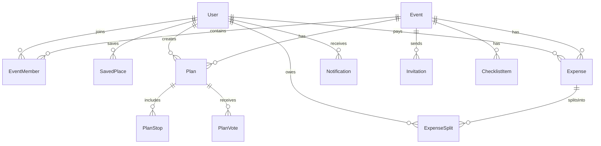

# Database Schema (Prisma / PostgreSQL)

> Đây là schema khởi điểm cho Nhóm 2 — mọi thay đổi cấu trúc bảng dưới đây phải thông báo Nhóm 4 (AI Agent) và Nhóm 3 (Data Lookup) trước khi merge (xem `01-workflow/git-workflow.md`).
>
> **Cập nhật (Tạ Quang Huy)**: bổ sung 4 bảng mới (`Expense`, `ExpenseSplit`, `ChecklistItem`, `Notification`) + 2 field vào `User` + 1 field vào `AgentLog`, dựa trên rà soát task-board của cả 6 người. Lý do chi tiết từng thay đổi ghi ở mục 6. Còn 1 mục **CHƯA CHỐT** (`ChatMessage`) để lại bàn bạc trong buổi họp, xem mục 7.

## 1. Sơ đồ quan hệ chính



## 2. Prisma schema (đầy đủ, đã gộp bản cập nhật)

```prisma
model User {
  id            String   @id @default(uuid())
  email         String   @unique
  passwordHash  String?  @map("password_hash")   // null nếu login qua OAuth
  fullName      String   @map("full_name")
  avatarUrl     String?  @map("avatar_url")
  provider      AuthProvider @default(LOCAL)
  role          SystemRole   @default(USER)        // (MỚI) quyền hệ thống, khác EventRole
  status        UserStatus   @default(ACTIVE)       // (MỚI) phục vụ Admin quản lý user
  createdAt     DateTime @default(now()) @map("created_at")

  eventMembers  EventMember[]
  savedPlaces   SavedPlace[]
  createdPlans  Plan[]
  expensesPaid  Expense[]
  expenseSplits ExpenseSplit[]
  notifications Notification[]

  @@map("users")
}

enum AuthProvider {
  LOCAL
  GOOGLE
  FACEBOOK
}

enum SystemRole {           // (MỚI)
  USER
  ADMIN
}

enum UserStatus {           // (MỚI)
  ACTIVE
  SUSPENDED
}

model Event {
  id          String   @id @default(uuid())
  name        String
  description String?
  type        EventType @default(TRAVEL)
  location    String?
  startDate   DateTime @map("start_date")
  endDate     DateTime @map("end_date")
  createdAt   DateTime @default(now()) @map("created_at")

  members         EventMember[]
  plans           Plan[]
  invitations     Invitation[]
  expenses        Expense[]
  checklistItems  ChecklistItem[]

  @@map("events")
}

enum EventType {
  TRAVEL       // Chuyến du lịch (nhiều ngày, lên lịch trình)
  DINING       // Đi ăn / chọn quán / chọn món
  HANGOUT      // Cafe, bar, gặp mặt nhẹ
  ENTERTAINMENT // Chỗ chơi: karaoke, bowling, escape room, arcade...
  SIGHTSEEING  // Tham quan: bảo tàng, triển lãm, di tích, check-in
  CUSTOM       // Tự định nghĩa (teambuilding, sinh nhật, ...)
}

model EventMember {
  id       String   @id @default(uuid())
  eventId  String   @map("event_id")
  userId   String   @map("user_id")
  role     EventRole @default(MEMBER)
  joinedAt DateTime @default(now()) @map("joined_at")

  event    Event @relation(fields: [eventId], references: [id])
  user     User  @relation(fields: [userId], references: [id])

  @@unique([eventId, userId])
  @@map("event_members")
}

enum EventRole {
  OWNER
  MEMBER
  VIEWER
}

model Plan {
  id            String   @id @default(uuid())
  eventId       String   @map("event_id")
  title         String
  status        PlanStatus @default(DRAFT)
  isAiGenerated Boolean  @default(false) @map("is_ai_generated")
  totalBudget   Decimal? @map("total_budget")
  createdById   String   @map("created_by_id")
  createdAt     DateTime @default(now()) @map("created_at")

  event         Event @relation(fields: [eventId], references: [id])
  createdBy     User  @relation(fields: [createdById], references: [id])
  stops         PlanStop[]
  votes         PlanVote[]

  @@map("plans")
}

enum PlanStatus {
  DRAFT           // AI đề xuất, chưa chốt
  VOTING
  CONFIRMED
  ARCHIVED
}

model PlanStop {
  id            String  @id @default(uuid())
  planId        String  @map("plan_id")
  order         Int
  placeName     String  @map("place_name")
  placeRefId    String? @map("place_ref_id")   // ID trả về từ Google Places (Nhóm 3)
  lat           Float?
  lng           Float?
  note          String?
  estimatedCost Decimal? @map("estimated_cost")
  category      StopCategory?       // Phân loại điểm dừng
  metadata      Json?               // Dữ liệu đặc thù theo category (menu, giá món, link đặt bàn/vé...)

  plan          Plan @relation(fields: [planId], references: [id])

  @@map("plan_stops")
}

enum StopCategory {
  ATTRACTION    // Điểm tham quan, check-in
  RESTAURANT    // Nhà hàng, quán ăn
  CAFE          // Quán cafe
  HOTEL         // Khách sạn, homestay
  ENTERTAINMENT // Khu vui chơi, karaoke, bowling
  TRANSPORT     // Di chuyển (sân bay, bến xe)
  SHOPPING      // Mua sắm
  OTHER         // Khác
}

model PlanVote {
  id        String   @id @default(uuid())
  planId    String   @map("plan_id")
  userId    String   @map("user_id")
  value     VoteValue
  comment   String?
  createdAt DateTime @default(now()) @map("created_at")

  plan      Plan @relation(fields: [planId], references: [id])

  @@unique([planId, userId])
  @@map("plan_votes")
}

enum VoteValue {
  UP
  DOWN
  NEUTRAL
}

model SavedPlace {
  id         String @id @default(uuid())
  userId     String @map("user_id")
  placeName  String @map("place_name")
  placeRefId String? @map("place_ref_id")
  rating     Int?
  note       String?

  user       User @relation(fields: [userId], references: [id])

  @@map("saved_places")
}

model Invitation {
  id            String           @id @default(uuid())
  eventId       String           @map("event_id")
  invitedBy     String           @map("invited_by")    // userId của người mời
  email         String?                                  // email người được mời (nếu chưa có tài khoản)
  invitedUserId String?          @map("invited_user_id") // userId nếu đã có tài khoản
  status        InvitationStatus @default(PENDING)
  createdAt     DateTime         @default(now()) @map("created_at")
  expiresAt     DateTime?        @map("expires_at")

  event         Event @relation(fields: [eventId], references: [id])

  @@map("invitations")
}

enum InvitationStatus {
  PENDING
  ACCEPTED
  DECLINED
  EXPIRED
}

model AgentLog {
  id           String   @id @default(uuid())
  agentName    String   @map("agent_name")
  eventId      String?  @map("event_id")
  planId       String?  @map("plan_id")        // (MỚI) truy vết log ứng với Plan cụ thể nào
  inputTokens  Int      @map("input_tokens")
  outputTokens Int      @map("output_tokens")
  durationMs   Int      @map("duration_ms")
  status       String
  createdAt    DateTime @default(now()) @map("created_at")

  @@map("agent_logs")   // phục vụ Nhóm 6 - Admin Dashboard theo dõi chi phí token
}

// ===== BẢNG MỚI: Chia tiền chung (TASK-404, TASK-409) =====

model Expense {
  id          String    @id @default(uuid())
  eventId     String    @map("event_id")
  planId      String?   @map("plan_id")        // liên kết Plan nếu chi phí gắn với 1 lịch trình cụ thể
  paidById    String    @map("paid_by_id")
  title       String
  amount      Decimal
  splitType   SplitType @default(EQUAL) @map("split_type")
  createdAt   DateTime  @default(now()) @map("created_at")

  event       Event @relation(fields: [eventId], references: [id])
  paidBy      User  @relation(fields: [paidById], references: [id])
  splits      ExpenseSplit[]

  @@map("expenses")
}

enum SplitType {
  EQUAL   // chia đều cho tất cả thành viên
  CUSTOM  // chia theo số tiền tự nhập cho từng người
}

model ExpenseSplit {
  id          String   @id @default(uuid())
  expenseId   String   @map("expense_id")
  userId      String   @map("user_id")
  amountOwed  Decimal  @map("amount_owed")
  isSettled   Boolean  @default(false) @map("is_settled")

  expense     Expense @relation(fields: [expenseId], references: [id])
  user        User    @relation(fields: [userId], references: [id])

  @@unique([expenseId, userId])
  @@map("expense_splits")
}

// ===== BẢNG MỚI: Checklist đồ cần mang (TASK-313, TASK-317) =====

model ChecklistItem {
  id            String   @id @default(uuid())
  eventId       String   @map("event_id")
  title         String
  isChecked     Boolean  @default(false) @map("is_checked")
  isAiGenerated Boolean  @default(false) @map("is_ai_generated")
  createdById   String?  @map("created_by_id")   // null nếu do AI tạo
  createdAt     DateTime @default(now()) @map("created_at")

  event         Event @relation(fields: [eventId], references: [id])

  @@map("checklist_items")
}

// ===== BẢNG MỚI: Thông báo trong app (TASK-311, luồng Realtime N5) =====

model Notification {
  id             String   @id @default(uuid())
  userId         String   @map("user_id")
  type           String   // INVITE | VOTE_OPEN | PLAN_CONFIRMED | EXPENSE_ADDED
  message        String
  isRead         Boolean  @default(false) @map("is_read")
  relatedEventId String?  @map("related_event_id")
  createdAt      DateTime @default(now()) @map("created_at")

  user           User @relation(fields: [userId], references: [id])

  @@map("notifications")
}
```

## 3. Quy tắc migration
- Mọi thay đổi schema qua `prisma migrate dev --name <mo-ta-thay-doi>`, commit cả file migration sinh ra (không sửa tay migration đã áp dụng ở môi trường chung).
- Migration đặt tên rõ nghĩa: `add_plan_status_enum`, `add_agent_logs_table`.
- Không xoá cột có dữ liệu quan trọng trực tiếp — cân nhắc migration 2 bước (deprecate → xoá sau) nếu đã lên staging/production.

## 4. Index cần lưu ý
- `event_members(event_id, user_id)` — unique, tra cứu phân quyền mỗi request.
- `plan_votes(plan_id, user_id)` — unique, tránh vote trùng.
- `agent_logs(created_at)` — phục vụ query thống kê Admin Dashboard theo thời gian.
- `invitations(event_id, email)` — tra cứu lời mời theo event.
- `plans(event_id, created_by_id)` — tra cứu plan theo người tạo.
- `expenses(event_id)` — (MỚI) liệt kê chi phí theo event.
- `expense_splits(expense_id, user_id)` — (MỚI) unique, tránh 1 user có 2 dòng nợ cho cùng 1 expense.
- `checklist_items(event_id)` — (MỚI) liệt kê checklist theo event.
- `notifications(user_id, is_read)` — (MỚI) truy vấn nhanh "thông báo chưa đọc" của 1 user.

## 5. Metadata JSON theo StopCategory
- RESTAURANT: `{ "menuItems": [{"name": "Phở bò", "price": 50000}], "cuisine": "Việt Nam", "bookingUrl": "..." }`
- ENTERTAINMENT: `{ "activity": "Karaoke", "pricePerPerson": 150000, "duration": "2h", "bookingUrl": "..." }`
- ATTRACTION: `{ "ticketPrice": 100000, "openingHours": "8:00-17:00", "tips": "Mang giày thoải mái" }`
- CAFE: `{ "vibe": "Rooftop view", "priceRange": "40k-80k", "bookingUrl": "..." }`
- HOTEL: `{ "checkIn": "14:00", "checkOut": "12:00", "pricePerNight": 800000, "bookingUrl": "..." }`

## 6. Lý do các thay đổi (căn cứ)

| Thay đổi | Task/tài liệu căn cứ | Vì sao cần |
|---|---|---|
| `User.role`, `User.status` | `TASK-405` (Admin Statistics APIs) | API `GET /admin/users` cần quản lý trạng thái user; `EventRole` chỉ có nghĩa trong 1 Event, không phải quyền hệ thống |
| Bảng `ChecklistItem` | `TASK-313`, `TASK-317` | Cần lưu trạng thái check/uncheck và phân biệt item AI gợi ý vs user tự thêm để tính progress bar |
| Bảng `Expense` + `ExpenseSplit` | `TASK-404`, `TASK-409` | `totalBudget`/`estimatedCost` chỉ là số dự trù, không phải số tiền thực chi và ai nợ ai |
| Bảng `Notification` | `TASK-311`, `system-architecture.md` (luồng notification) | Cần lưu lại lịch sử thông báo trong app, không chỉ gửi email một lần rồi mất |
| `AgentLog.planId` | Nhu cầu debug thực tế | Truy vết log AI ứng với đúng Plan nào, không chỉ Event chung chung |

## 7. CHƯA CHỐT — cần bàn trong buổi họp Contract Session

- **`ChatMessage` (lịch sử chat AI)**: `ai-agent-architecture.md` có nhắc `conversation_history` nhưng chưa rõ lưu tạm (RAM/session) hay lưu vĩnh viễn vào DB. **Cần hỏi trực tiếp AI Lead (Nguyễn Tùng Dương)** trước khi quyết định thêm bảng này.