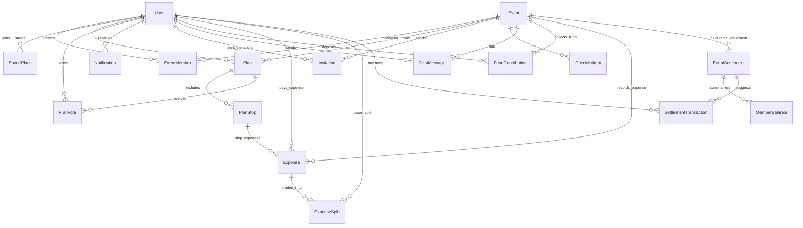

# Database Schema (Prisma / PostgreSQL)

> **Tài liệu chuẩn kiến trúc Database** cho dự án Web Lên Kế Hoạch Nhóm Tích Hợp AI Multi-Agent.
>
> **Cập nhật quan trọng (Tích hợp AI Cost Agent & Hệ thống Quản lý / Chia Tiền Chuyến Đi)**:
> Bổ sung toàn bộ hệ thống quản lý tài chính 3 giai đoạn: **Dự toán AI (Cost Agent)** $\rightarrow$ **Quỹ nhóm & Ghi nhận chi phí thực tế** $\rightarrow$ **AI Tự động Quyết toán & Bù trừ nợ tối ưu (Optimal Settlement)**.

---

## 1. Sơ đồ quan hệ chính (ERD)



---

## 2. Prisma Schema (Đầy đủ)

```prisma
datasource db {
  provider = "postgresql"
  url      = env("DATABASE_URL")
}

generator client {
  provider = "prisma-client-js"
}

// ==========================================
// 1. USER & AUTHENTICATION
// ==========================================

model User {
  id            String       @id @default(uuid())
  email         String       @unique
  passwordHash  String?      @map("password_hash")   // null nếu login qua OAuth
  fullName      String       @map("full_name")
  avatarUrl     String?      @map("avatar_url")
  provider      AuthProvider @default(LOCAL)
  role          SystemRole   @default(USER)        // Quyền hệ thống (USER/ADMIN)
  status        UserStatus   @default(ACTIVE)      // Phục vụ Admin quản lý user
  createdAt     DateTime     @default(now()) @map("created_at")

  // Relations
  eventMembers        EventMember[]
  savedPlaces         SavedPlace[]
  createdPlans        Plan[]
  notifications       Notification[]
  votedPlans          PlanVote[]
  sentInvitations     Invitation[]            @relation("InvitationsSent")
  receivedInvitations Invitation[]            @relation("InvitationsReceived")
  createdChecklistItems ChecklistItem[]
  chatMessages          ChatMessage[]
  
  // Financial Relations (Quản lý tài chính & Chia tiền)
  fundContributions   FundContribution[]
  paidExpenses        Expense[]               @relation("ExpensesPaid")
  expenseSplits       ExpenseSplit[]
  memberBalances      MemberBalance[]
  settlementsFrom     SettlementTransaction[] @relation("SettlementsFrom")
  settlementsTo       SettlementTransaction[] @relation("SettlementsTo")

  @@map("users")
}

enum AuthProvider {
  LOCAL
  GOOGLE
  FACEBOOK
}

enum SystemRole {
  USER
  ADMIN
}

enum UserStatus {
  ACTIVE
  SUSPENDED
}

// ==========================================
// 2. EVENT & MEMBERSHIP
// ==========================================

model Event {
  id          String    @id @default(uuid())
  name        String
  description String?
  type        EventType @default(TRAVEL)
  location    String?
  startDate   DateTime  @map("start_date")
  endDate     DateTime  @map("end_date")
  createdAt   DateTime  @default(now()) @map("created_at")

  // Relations
  members           EventMember[]
  plans             Plan[]
  invitations       Invitation[]
  checklistItems    ChecklistItem[]
  chatMessages      ChatMessage[]
  
  // Financial Relations
  fundContributions FundContribution[]
  expenses          Expense[]
  settlements       EventSettlement[]

  @@map("events")
}

enum EventType {
  TRAVEL        // Chuyến du lịch (nhiều ngày, lên lịch trình)
  DINING        // Đi ăn / chọn quán / chọn món
  HANGOUT       // Cafe, bar, gặp mặt nhẹ
  ENTERTAINMENT // Chỗ chơi: karaoke, bowling, escape room, arcade...
  SIGHTSEEING   // Tham quan: bảo tàng, triển lãm, di tích, check-in
  CUSTOM        // Tự định nghĩa (teambuilding, sinh nhật, ...)
}

model EventMember {
  id       String    @id @default(uuid())
  eventId  String    @map("event_id")
  userId   String    @map("user_id")
  role     EventRole @default(MEMBER)
  joinedAt DateTime  @default(now()) @map("joined_at")

  event    Event     @relation(fields: [eventId], references: [id], onDelete: Cascade)
  user     User      @relation(fields: [userId], references: [id], onDelete: Cascade)

  @@unique([eventId, userId])
  @@map("event_members")
}

enum EventRole {
  OWNER
  MEMBER
  VIEWER
}

// ==========================================
// 3. PLAN & ITINERARY (AI DỰ TOÁN CHI PHÍ)
// ==========================================

model Plan {
  id            String     @id @default(uuid())
  eventId       String     @map("event_id")
  title         String
  status        PlanStatus @default(DRAFT)
  isAiGenerated Boolean    @default(false) @map("is_ai_generated")
  totalBudget   Decimal?   @map("total_budget")   // AI Cost Agent ghi tổng dự toán ngân sách
  createdById   String?    @map("created_by_id")
  createdAt     DateTime   @default(now()) @map("created_at")

  event         Event      @relation(fields: [eventId], references: [id], onDelete: Cascade)
  createdBy     User?      @relation(fields: [createdById], references: [id], onDelete: SetNull)
  stops         PlanStop[]
  votes         PlanVote[]

  @@map("plans")
}

enum PlanStatus {
  DRAFT        // AI đề xuất, chưa chốt
  VOTING
  CONFIRMED
  ARCHIVED
}

model PlanStop {
  id              String        @id @default(uuid())
  planId          String        @map("plan_id")
  order           Int
  placeName       String        @map("place_name")
  placeRefId      String?       @map("place_ref_id")
  lat             Float?
  lng             Float?
  note            String?
  estimatedCost   Decimal?      @map("estimated_cost") // AI Cost Agent dự tính tiền trước cho điểm này
  category        StopCategory?
  startTime       DateTime?     @map("start_time")
  durationMinutes Int?          @map("duration_minutes")
  metadata        Json?

  plan            Plan          @relation(fields: [planId], references: [id], onDelete: Cascade)
  expenses        Expense[]     // Liên kết các chi phí thực tế phát sinh tại điểm dừng này

  @@map("plan_stops")
}

enum StopCategory {
  ATTRACTION    // Điểm tham quan, check-in
  RESTAURANT    // Nhà hàng, quán ăn
  CAFE          // Quán cafe
  HOTEL         // Khách sạn, homestay
  ENTERTAINMENT // Khu vui chơi, karaoke, bowling
  TRANSPORT     // Di chuyển (sân bay, xe cộ)
  SHOPPING      // Mua sắm
  OTHER         // Khác
}

model PlanVote {
  id        String    @id @default(uuid())
  planId    String    @map("plan_id")
  userId    String    @map("user_id")
  value     VoteValue
  comment   String?
  createdAt DateTime  @default(now()) @map("created_at")

  plan      Plan      @relation(fields: [planId], references: [id], onDelete: Cascade)
  user      User      @relation(fields: [userId], references: [id], onDelete: Cascade)

  @@unique([planId, userId])
  @@map("plan_votes")
}

enum VoteValue {
  UP
  DOWN
  NEUTRAL
}

// ==========================================
// 4. QUẢN LÝ TÀI CHÍNH: QUỸ & CHI PHÍ THỰC TẾ
// ==========================================

// Bảng 1: Quỹ nhóm đóng trước (Thu mỗi người trước X tiền)
model FundContribution {
  id        String   @id @default(uuid())
  eventId   String   @map("event_id")
  userId    String   @map("user_id")
  amount    Decimal  // Số tiền thành viên nộp vào quỹ (VD: 1,000)
  note      String?  // Ghi chú (VD: "Đóng quỹ đợt 1")
  paidAt    DateTime @default(now()) @map("paid_at")

  event     Event    @relation(fields: [eventId], references: [id], onDelete: Cascade)
  user      User     @relation(fields: [userId], references: [id], onDelete: Cascade)

  @@map("fund_contributions")
}

// Bảng 2: Ghi nhận Chi phí thực tế (Actual Expenses) phát sinh trong sự kiện
model Expense {
  id          String        @id @default(uuid())
  eventId     String        @map("event_id")
  planStopId  String?       @map("plan_stop_id") // Nullable (nếu chi ngoài kế hoạch)
  paidById    String        @map("paid_by_id")   // Thành viên đứng ra trả tiền trước
  title       String                             // Tiêu đề (VD: "Tiền phòng homestay", "Ăn tối")
  amount      Decimal                            // Tổng số tiền đã trả (VD: 5,000)
  category    StopCategory?
  splitType   SplitType     @default(EQUAL) @map("split_type")
  note        String?                            // Ghi chú thêm (VD: "4000 trả tiền phòng")
  receiptUrl  String?       @map("receipt_url")  // Link ảnh hóa đơn/chuyển khoản
  createdAt   DateTime      @default(now()) @map("created_at")

  event       Event         @relation(fields: [eventId], references: [id], onDelete: Cascade)
  planStop    PlanStop?     @relation(fields: [planStopId], references: [id], onDelete: SetNull)
  paidBy      User          @relation("ExpensesPaid", fields: [paidById], references: [id], onDelete: Cascade)
  splits      ExpenseSplit[]

  @@map("expenses")
}

enum SplitType {
  EQUAL       // Chia đều cho các thành viên chọn
  EXACT       // Chia chỉ định chính xác số tiền từng người
  PERCENTAGE  // Chia theo tỷ lệ phần trăm
}

// Bảng 3: Chi tiết phần chi phí gánh của từng thành viên trong khoản chi
model ExpenseSplit {
  id        String   @id @default(uuid())
  expenseId String   @map("expense_id")
  userId    String   @map("user_id")
  amount    Decimal  // Số tiền thành viên này chịu cho khoản chi này

  expense   Expense  @relation(fields: [expenseId], references: [id], onDelete: Cascade)
  user      User     @relation(fields: [userId], references: [id], onDelete: Cascade)

  @@unique([expenseId, userId])
  @@map("expense_splits")
}

// ==========================================
// 5. AI QUYẾT TOÁN & BÙ TRỪ NỢ (SETTLEMENT)
// ==========================================

// Bảng Báo cáo chốt quyết toán sự kiện
model EventSettlement {
  id               String    @id @default(uuid())
  eventId          String    @map("event_id")
  totalFundPaid    Decimal   @default(0) @map("total_fund_paid")    // Tổng quỹ đã thu
  totalExpensePaid Decimal   @default(0) @map("total_expense_paid") // Tổng tiền thành viên tự ứng ra
  totalCost        Decimal   @default(0) @map("total_cost")         // Tổng chi phí thực tế phát sinh
  perMemberShare   Decimal   @default(0) @map("per_member_share")   // Mức chi bình quân mỗi người
  isClosed         Boolean   @default(false) @map("is_closed")      // Đã chốt xong chưa
  closedAt         DateTime? @map("closed_at")
  createdAt        DateTime  @default(now()) @map("created_at")

  event            Event                   @relation(fields: [eventId], references: [id], onDelete: Cascade)
  memberBalances   MemberBalance[]
  transactions     SettlementTransaction[]

  @@map("event_settlements")
}

// Bảng Tổng kết số dư tài chính từng thành viên
model MemberBalance {
  id           String          @id @default(uuid())
  settlementId String          @map("settlement_id")
  userId       String          @map("user_id")
  fundPaid     Decimal         @default(0) @map("fund_paid")    // Tiền đóng quỹ (VD: 1,000)
  expensePaid  Decimal         @default(0) @map("expense_paid") // Tiền tự chi ra ngoài (VD: 100, 300, 800, 5,000)
  totalPaid    Decimal         @default(0) @map("total_paid")   // Tổng đã nộp/ứng (fundPaid + expensePaid)
  targetShare  Decimal         @default(0) @map("target_share") // Tổng nghĩa vụ phải chịu (VD: 2,300)
  netBalance   Decimal         @default(0) @map("net_balance")  // Số dư nợ ròng (totalPaid - targetShare)

  settlement   EventSettlement @relation(fields: [settlementId], references: [id], onDelete: Cascade)
  user         User            @relation(fields: [userId], references: [id], onDelete: Cascade)

  @@unique([settlementId, userId])
  @@map("member_balances")
}

// Bảng Gợi ý Giao dịch Bù trừ Nợ Tối ưu (AI tính toán để giảm số lần chuyển tiền)
model SettlementTransaction {
  id           String          @id @default(uuid())
  settlementId String          @map("settlement_id")
  fromUserId   String          @map("from_user_id") // Người phải chuyển tiền đi (nợ)
  toUserId     String          @map("to_user_id")   // Người nhận tiền về (dư)
  amount       Decimal                              // Số tiền cần chuyển
  isSettled    Boolean         @default(false) @map("is_settled")
  settledAt    DateTime?       @map("settled_at")

  settlement   EventSettlement @relation(fields: [settlementId], references: [id], onDelete: Cascade)
  fromUser     User            @relation("SettlementsFrom", fields: [fromUserId], references: [id], onDelete: Cascade)
  toUser       User            @relation("SettlementsTo", fields: [toUserId], references: [id], onDelete: Cascade)

  @@map("settlement_transactions")
}

// ==========================================
// 6. CHECKLIST, NOTIFICATION, CHAT & LOGS
// ==========================================

model SavedPlace {
  id         String  @id @default(uuid())
  userId     String  @map("user_id")
  placeName  String  @map("place_name")
  placeRefId String? @map("place_ref_id")
  rating     Int?
  note       String?

  user       User    @relation(fields: [userId], references: [id], onDelete: Cascade)

  @@map("saved_places")
}

model Invitation {
  id            String           @id @default(uuid())
  eventId       String           @map("event_id")
  invitedBy     String           @map("invited_by")
  email         String?
  invitedUserId String?          @map("invited_user_id")
  status        InvitationStatus @default(PENDING)
  createdAt     DateTime         @default(now()) @map("created_at")
  expiresAt     DateTime?        @map("expires_at")

  event         Event            @relation(fields: [eventId], references: [id], onDelete: Cascade)
  invitedByUser User             @relation("InvitationsSent", fields: [invitedBy], references: [id], onDelete: Cascade)
  invitedUser   User?            @relation("InvitationsReceived", fields: [invitedUserId], references: [id], onDelete: SetNull)

  @@map("invitations")
}

enum InvitationStatus {
  PENDING
  ACCEPTED
  DECLINED
  EXPIRED
}

model ChecklistItem {
  id            String   @id @default(uuid())
  eventId       String   @map("event_id")
  title         String
  isChecked     Boolean  @default(false) @map("is_checked")
  isAiGenerated Boolean  @default(false) @map("is_ai_generated")
  createdById   String?  @map("created_by_id")
  createdAt     DateTime @default(now()) @map("created_at")

  event         Event    @relation(fields: [eventId], references: [id], onDelete: Cascade)
  createdBy     User?    @relation(fields: [createdById], references: [id], onDelete: SetNull)

  @@map("checklist_items")
}

model Notification {
  id             String   @id @default(uuid())
  userId         String   @map("user_id")
  type           String   // INVITE | VOTE_OPEN | PLAN_CONFIRMED | SETTLEMENT_READY
  message        String
  isRead         Boolean  @default(false) @map("is_read")
  relatedEventId String?  @map("related_event_id")
  createdAt      DateTime @default(now()) @map("created_at")

  user           User     @relation(fields: [userId], references: [id], onDelete: Cascade)

  @@map("notifications")
}

model ChatMessage {
  id        String   @id @default(uuid())
  eventId   String   @map("event_id")
  userId    String?  @map("user_id")
  role      ChatRole
  content   String
  agentName String?  @map("agent_name")
  createdAt DateTime @default(now()) @map("created_at")

  event     Event    @relation(fields: [eventId], references: [id], onDelete: Cascade)
  user      User?    @relation(fields: [userId], references: [id], onDelete: SetNull)

  @@index([eventId, createdAt])
  @@map("chat_messages")
}

enum ChatRole {
  USER
  ASSISTANT
  SYSTEM
}

model AgentLog {
  id           String   @id @default(uuid())
  agentName    String   @map("agent_name")
  eventId      String?  @map("event_id")
  planId       String?  @map("plan_id")
  inputTokens  Int      @map("input_tokens")
  outputTokens Int      @map("output_tokens")
  durationMs   Int      @map("duration_ms")
  status       String
  createdAt    DateTime @default(now()) @map("created_at")

  @@map("agent_logs")
}
```

---

## 3. Quy trình & Thuật toán Quyết toán Chi phí (Ví dụ thực tế)

### 💡 Bài toán thực tế
Giả sử nhóm có 4 thành viên (**A, B, C, D**) tham gia chuyến đi:
1. **Thu tiền quỹ trước**: Mỗi người đóng trước `1,000` vào quỹ nhóm.
2. **Chi phí thực tế phát sinh trong chuyến đi**:
   - Thành viên **A** trả ngoài: `100` (Tiền nước)
   - Thành viên **B** trả ngoài: `300` (Tiền taxi)
   - Thành viên **C** trả ngoài: `800` (Tiền ăn tối)
   - Thành viên **D** trả ngoài: `5,000` (bao gồm `4,000` tiền phòng + `1,000` chi phí chung)

---

### 📐 Công thức & Luồng tính toán của AI Cost Agent

#### Bước 1: Tính tổng chi phí thực tế & Nghĩa vụ mỗi người phải gánh (`target_share`)
* **Tổng tiền đã ứng ra (Quỹ + Trả ngoài)**: 
  $$\text{Tổng đóng/ứng} = \sum (\text{FundPaid} + \text{ExpensePaid})$$
  - A: $1000 + 100 = 1100$
  - B: $1000 + 300 = 1300$
  - C: $1000 + 800 = 1800$
  - D: $1000 + 5000 = 6000$
  - **Tổng toàn bộ tiền chi trả**: $1100 + 1300 + 1800 + 6000 = 9200$

* **Chi phí bình quân mỗi người phải chịu (`target_share`)**:
  $$\text{Mức gánh chi phí/người} = \frac{\text{Tổng chi phí}}{N} = \frac{9200}{4} = 2300$$

---

#### Bước 2: Tính số dư ròng (`net_balance`) của từng người
$$\text{NetBalance} = \text{TotalPaid} - \text{TargetShare}$$

| Thành viên | Đã đóng quỹ | Tự chi trả | Tổng đã đóng (`TotalPaid`) | Mức phải chịu (`TargetShare`) | Số dư ròng (`NetBalance`) | Trạng thái tài chính |
|---|---|---|---|---|---|---|
| **A** | 1,000 | 100 | **1,100** | 2,300 | **-1,200** | 🔴 Nợ thêm 1,200 |
| **B** | 1,000 | 300 | **1,300** | 2,300 | **-1,000** | 🔴 Nợ thêm 1,000 |
| **C** | 1,000 | 800 | **1,800** | 2,300 | **-500** | 🔴 Nợ thêm 500 |
| **D** | 1,000 | 5,000 | **6,000** | 2,300 | **+3,700** | 🟢 Được nhận lại 3,700 |
| **TỔNG** | 4,000 | 6,200 | **10,200** | 9,200 | **0** | **Cân bằng tuyệt đối** |

---

#### Bước 3: Thuật toán Bù trừ Nợ Tối ưu (Optimal Debt Settlement)
Hệ thống / AI Cost Agent sẽ tự động ghép cặp người nợ âm với người dư dương để **tối thiểu hóa số lượng giao dịch chuyển khoản**:

1. **A** nợ 1,200 $\rightarrow$ Chuyển trực tiếp cho **D**: **1,200**
2. **B** nợ 1,000 $\rightarrow$ Chuyển trực tiếp cho **D**: **1,000**
3. **C** nợ 500 $\rightarrow$ Chuyển trực tiếp cho **D**: **500**
4. **D** nhận từ A (1,200) + B (1,000) + C (500) = **2,700**, cộng thêm **1,000** rút từ Quỹ chung còn lại $\rightarrow$ Tổng nhận đúng **3,700**.

Kết quả: Chỉ cần **3 giao dịch chuyển khoản**, tất cả thành viên về đúng 0đ chênh lệch!

---

## 4. Index & Quy tắc Performance

- `fund_contributions(event_id, user_id)` — Tra cứu nhanh lịch sử đóng quỹ.
- `expenses(event_id, paid_by_id)` — Truy vấn nhanh các khoản chi của sự kiện.
- `expense_splits(expense_id, user_id)` — Unique constraint chống chia trùng.
- `member_balances(settlement_id, user_id)` — Unique constraint cho bảng tổng kết số dư.
- `settlement_transactions(settlement_id, from_user_id, to_user_id)` — Truy vấn danh sách giao dịch chuyển tiền cần thực hiện.
- All FK relations include `onDelete: Cascade` / `SetNull` thích hợp để đảm bảo tính toàn vẹn dữ liệu.

---

## 5. Nhật ký thay đổi Schema (Change Log)

| Ngày | Người sửa | Nội dung sửa | Lý do |
|---|---|---|---|
| Sprint 0 | Tạ Quang Huy | Đã tạm bỏ feature Expense chi tiết | Giảm độ phức tạp ban đầu |
| **Sprint 1 (Mới)** | **Tạ Quang Huy** | **Khôi phục & Nâng cấp Hệ thống Quản lý Tài chính 3 Giai đoạn** (`FundContribution`, `Expense`, `ExpenseSplit`, `EventSettlement`, `MemberBalance`, `SettlementTransaction`) | Hỗ trợ tính năng AI Cost Agent dự tính trước + thu tiền quỹ trước + nốt chi phí thực tế + tự động tính nợ ròng và gợi ý chuyển tiền tối ưu theo bài toán thực tế. |