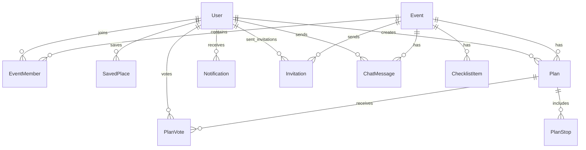

# Database Schema (Prisma / PostgreSQL)

> Đây là schema khởi điểm cho Nhóm 2 — mọi thay đổi cấu trúc bảng dưới đây phải thông báo Nhóm 4 (AI Agent) và Nhóm 3 (Data Lookup) trước khi merge (xem `01-workflow/git-workflow.md`).
>
> **Cập nhật (Tạ Quang Huy)**: bổ sung 3 bảng mới (`ChecklistItem`, `Notification`) + 2 field vào `User` + 1 field vào `AgentLog`, dựa trên rà soát task-board của cả 6 người. Lý do chi tiết từng thay đổi ghi ở mục 6. Còn 1 mục **CHƯA CHỐT** (`ChatMessage`) để lại bàn bạc trong buổi họp, xem mục 7.
>
> **Cập nhật sau họp Sprint 0 (theo `Report_Schema.docx`)**: xem đầy đủ danh sách quyết định ở mục 8. Tóm tắt: bỏ tính năng chia tiền chi tiết (Expense/ExpenseSplit), thêm relation còn thiếu ở `PlanVote`/`User`/`Invitation`, thêm `onDelete` để tránh lỗi xoá dữ liệu tham chiếu, thêm thời gian dừng vào `PlanStop`.
>
> **Cập nhật lần 3**: team đã chốt lưu lịch sử chat AI vào database — thêm bảng `ChatMessage`. Mục 7 (trước đây "chưa chốt") nay đã giải quyết xong.

## 1. Sơ đồ quan hệ chính



## 2. Prisma schema (đầy đủ, đã gộp bản cập nhật)

```prisma
model User {
  id            String   @id @default(uuid())
  email         String   @unique
  passwordHash  String?  @map("password_hash")   // null nếu login qua OAuth
  fullName      String   @map("full_name")
  avatarUrl     String?  @map("avatar_url")
  provider      AuthProvider @default(LOCAL)
  role          SystemRole   @default(USER)        // (MỚI) quyền hệ thống, khác EventRole
  status        UserStatus   @default(ACTIVE)       // (MỚI) phục vụ Admin quản lý user
  createdAt     DateTime @default(now()) @map("created_at")

  eventMembers        EventMember[]
  savedPlaces         SavedPlace[]
  createdPlans        Plan[]
  notifications       Notification[]
  votedPlans          PlanVote[]                                  // [SỬA - họp Sprint 0] trước đây thiếu, User không biết mình đã vote plan nào
  sentInvitations     Invitation[] @relation("InvitationsSent")     // [SỬA - họp Sprint 0] danh sách lời mời mình đã gửi
  receivedInvitations Invitation[] @relation("InvitationsReceived") // [SỬA - họp Sprint 0] danh sách lời mời mình được nhận
  createdChecklistItems ChecklistItem[]                            // [SỬA] khớp với relation createdBy đã thêm ở ChecklistItem
  chatMessages          ChatMessage[]                              // [MỚI] tin nhắn user gửi cho AI Chat Agent

  @@map("users")
}

enum AuthProvider {
  LOCAL
  GOOGLE
  FACEBOOK
}

enum SystemRole {           // (MỚI)
  USER
  ADMIN
}

enum UserStatus {           // (MỚI)
  ACTIVE
  SUSPENDED
}

model Event {
  id          String   @id @default(uuid())
  name        String
  description String?
  type        EventType @default(TRAVEL)
  location    String?
  startDate   DateTime @map("start_date")
  endDate     DateTime @map("end_date")
  createdAt   DateTime @default(now()) @map("created_at")

  members         EventMember[]
  plans           Plan[]
  invitations     Invitation[]
  checklistItems  ChecklistItem[]
  chatMessages    ChatMessage[]   // [MỚI] lịch sử chat AI, checkpoint theo eventId (xem ai-agent-architecture.md mục 3)

  @@map("events")
}

enum EventType {
  TRAVEL       // Chuyến du lịch (nhiều ngày, lên lịch trình)
  DINING       // Đi ăn / chọn quán / chọn món
  HANGOUT      // Cafe, bar, gặp mặt nhẹ
  ENTERTAINMENT // Chỗ chơi: karaoke, bowling, escape room, arcade...
  SIGHTSEEING  // Tham quan: bảo tàng, triển lãm, di tích, check-in
  CUSTOM       // Tự định nghĩa (teambuilding, sinh nhật, ...)
}

model EventMember {
  id       String   @id @default(uuid())
  eventId  String   @map("event_id")
  userId   String   @map("user_id")
  role     EventRole @default(MEMBER)
  joinedAt DateTime @default(now()) @map("joined_at")

  event    Event @relation(fields: [eventId], references: [id], onDelete: Cascade)   // [SỬA - họp Sprint 0] xoá Event thì xoá luôn membership, tránh lỗi FK
  user     User  @relation(fields: [userId], references: [id], onDelete: Cascade)    // [SỬA - họp Sprint 0] xoá User thì xoá luôn membership của họ

  @@unique([eventId, userId])
  @@map("event_members")
}

enum EventRole {
  OWNER
  MEMBER
  VIEWER
}

model Plan {
  id            String   @id @default(uuid())
  eventId       String   @map("event_id")
  title         String
  status        PlanStatus @default(DRAFT)
  isAiGenerated Boolean  @default(false) @map("is_ai_generated")
  totalBudget   Decimal? @map("total_budget")   // [SỬA - họp Sprint 0] bỏ tính năng chia tiền chi tiết (feature #41); cột này là nơi duy nhất lưu dự đoán TỔNG chi phí, do AI (Cost Agent) ghi vào khi tạo Plan
  createdById   String?  @map("created_by_id")  // [SỬA - họp Sprint 0] cho phép null để dùng onDelete: SetNull bên dưới
  createdAt     DateTime @default(now()) @map("created_at")

  event         Event @relation(fields: [eventId], references: [id], onDelete: Cascade)      // [SỬA - họp Sprint 0] xoá Event thì xoá luôn Plan, tránh lỗi FK
  createdBy     User? @relation(fields: [createdById], references: [id], onDelete: SetNull)  // [SỬA - họp Sprint 0] xoá User thì giữ lại Plan (vì thuộc cả nhóm), chỉ set null người tạo
  stops         PlanStop[]
  votes         PlanVote[]

  @@map("plans")
}

enum PlanStatus {
  DRAFT           // AI đề xuất, chưa chốt
  VOTING
  CONFIRMED
  ARCHIVED
}

model PlanStop {
  id              String    @id @default(uuid())
  planId          String    @map("plan_id")
  order           Int                                   // vẫn giữ làm phương án dự phòng khi chưa xếp giờ cụ thể
  placeName       String    @map("place_name")
  placeRefId      String?   @map("place_ref_id")         // ID trả về từ Google Places (Nhóm 3)
  lat             Float?
  lng             Float?
  note            String?
  estimatedCost   Decimal?  @map("estimated_cost")
  category        StopCategory?                          // Phân loại điểm dừng
  startTime       DateTime? @map("start_time")            // [SỬA - họp Sprint 0] ngày + giờ bắt đầu dừng, null nếu chưa xếp giờ
  durationMinutes Int?      @map("duration_minutes")      // [SỬA - họp Sprint 0] thời lượng dừng (phút), thay cho việc nhét "2h" vào metadata
  metadata        Json?                                   // Dữ liệu đặc thù theo category (menu, giá món, link đặt bàn/vé...)

  plan            Plan @relation(fields: [planId], references: [id], onDelete: Cascade)   // [SỬA - họp Sprint 0] xoá Plan thì xoá luôn các stop, tránh lỗi FK

  @@map("plan_stops")
}

enum StopCategory {
  ATTRACTION    // Điểm tham quan, check-in
  RESTAURANT    // Nhà hàng, quán ăn
  CAFE          // Quán cafe
  HOTEL         // Khách sạn, homestay
  ENTERTAINMENT // Khu vui chơi, karaoke, bowling
  TRANSPORT     // Di chuyển (sân bay, bến xe)
  SHOPPING      // Mua sắm
  OTHER         // Khác
}

model PlanVote {
  id        String   @id @default(uuid())
  planId    String   @map("plan_id")
  userId    String   @map("user_id")
  value     VoteValue
  comment   String?
  createdAt DateTime @default(now()) @map("created_at")

  plan      Plan @relation(fields: [planId], references: [id], onDelete: Cascade)   // [SỬA - họp Sprint 0] xoá Plan thì xoá luôn vote, tránh lỗi FK
  user      User @relation(fields: [userId], references: [id], onDelete: Cascade)   // [SỬA - họp Sprint 0] trước đây thiếu relation này, chỉ có userId trơn

  @@unique([planId, userId])
  @@map("plan_votes")
}

enum VoteValue {
  UP
  DOWN
  NEUTRAL
}

model SavedPlace {
  id         String @id @default(uuid())
  userId     String @map("user_id")
  placeName  String @map("place_name")
  placeRefId String? @map("place_ref_id")
  rating     Int?
  note       String?

  user       User @relation(fields: [userId], references: [id], onDelete: Cascade)   // [SỬA - họp Sprint 0] xoá User thì xoá luôn địa điểm đã lưu

  @@map("saved_places")
}

model Invitation {
  id            String           @id @default(uuid())
  eventId       String           @map("event_id")
  invitedBy     String           @map("invited_by")    // userId của người mời
  email         String?                                  // email người được mời (nếu chưa có tài khoản)
  invitedUserId String?          @map("invited_user_id") // userId nếu đã có tài khoản
  status        InvitationStatus @default(PENDING)
  createdAt     DateTime         @default(now()) @map("created_at")
  expiresAt     DateTime?        @map("expires_at")

  event         Event @relation(fields: [eventId], references: [id], onDelete: Cascade)                                    // [SỬA - họp Sprint 0] xoá Event thì xoá luôn lời mời
  invitedByUser User  @relation("InvitationsSent", fields: [invitedBy], references: [id], onDelete: Cascade)               // [SỬA - họp Sprint 0] trước đây thiếu, không biết ai đã gửi
  invitedUser   User? @relation("InvitationsReceived", fields: [invitedUserId], references: [id], onDelete: SetNull)       // [SỬA - họp Sprint 0] trước đây thiếu, invitedUserId chỉ là chuỗi trơn; đặt tên relation riêng ("InvitationsSent"/"InvitationsReceived") vì Invitation trỏ tới User qua 2 field khác nhau, Prisma bắt buộc phải phân biệt

  @@map("invitations")
}

enum InvitationStatus {
  PENDING
  ACCEPTED
  DECLINED
  EXPIRED
}

model AgentLog {
  id           String   @id @default(uuid())
  agentName    String   @map("agent_name")
  eventId      String?  @map("event_id")
  planId       String?  @map("plan_id")        // (MỚI) truy vết log ứng với Plan cụ thể nào
  inputTokens  Int      @map("input_tokens")
  outputTokens Int      @map("output_tokens")
  durationMs   Int      @map("duration_ms")
  status       String
  createdAt    DateTime @default(now()) @map("created_at")

  @@map("agent_logs")   // phục vụ Nhóm 6 - Admin Dashboard theo dõi chi phí token
}


// Nếu sau này team muốn làm lại tính năng chia tiền chi tiết, xem lại lịch sử git của file này.

// ===== BẢNG MỚI: Checklist đồ cần mang (TASK-313, TASK-317) =====

model ChecklistItem {
  id            String   @id @default(uuid())
  eventId       String   @map("event_id")
  title         String
  isChecked     Boolean  @default(false) @map("is_checked")
  isAiGenerated Boolean  @default(false) @map("is_ai_generated")
  createdById   String?  @map("created_by_id")   // null nếu do AI tạo
  createdAt     DateTime @default(now()) @map("created_at")

  event         Event @relation(fields: [eventId], references: [id], onDelete: Cascade)     // [SỬA - họp Sprint 0] xoá Event thì xoá luôn checklist
  createdBy     User? @relation(fields: [createdById], references: [id], onDelete: SetNull)  // [SỬA - họp Sprint 0] cùng đợt sửa relation còn thiếu, giữ item nếu User bị xoá

  @@map("checklist_items")
}

// ===== BẢNG MỚI: Thông báo trong app (TASK-311, luồng Realtime N5) =====

model Notification {
  id             String   @id @default(uuid())
  userId         String   @map("user_id")
  type           String   // INVITE | VOTE_OPEN | PLAN_CONFIRMED   // [SỬA - họp Sprint 0] bỏ EXPENSE_ADDED vì đã xoá feature Expense
  message        String
  isRead         Boolean  @default(false) @map("is_read")
  relatedEventId String?  @map("related_event_id")
  createdAt      DateTime @default(now()) @map("created_at")

  user           User @relation(fields: [userId], references: [id], onDelete: Cascade)   // [SỬA - họp Sprint 0] xoá User thì xoá luôn thông báo của họ

  @@map("notifications")
}

// ===== BẢNG MỚI: Lịch sử chat AI (đã chốt lưu vào DB) =====

model ChatMessage {
  id        String      @id @default(uuid())
  eventId   String      @map("event_id")           // khớp cách checkpoint theo eventId trong ai-agent-architecture.md
  userId    String?     @map("user_id")             // null nếu là tin nhắn của AI (assistant)
  role      ChatRole
  content   String                                  // nội dung tin nhắn (giữ nguyên text, không giới hạn độ dài)
  agentName String?     @map("agent_name")          // agent nào trả lời (Orchestrator/Location/Plan/Cost...), null nếu là tin của user
  createdAt DateTime    @default(now()) @map("created_at")

  event     Event @relation(fields: [eventId], references: [id], onDelete: Cascade)
  user      User? @relation(fields: [userId], references: [id], onDelete: SetNull)

  @@index([eventId, createdAt])
  @@map("chat_messages")
}

enum ChatRole {
  USER
  ASSISTANT
  SYSTEM
}
```

## 3. Quy tắc migration
- Mọi thay đổi schema qua `prisma migrate dev --name <mo-ta-thay-doi>`, commit cả file migration sinh ra (không sửa tay migration đã áp dụng ở môi trường chung).
- Migration đặt tên rõ nghĩa: `add_plan_status_enum`, `add_agent_logs_table`.
- Không xoá cột có dữ liệu quan trọng trực tiếp — cân nhắc migration 2 bước (deprecate → xoá sau) nếu đã lên staging/production.

## 4. Index cần lưu ý
- `event_members(event_id, user_id)` — unique, tra cứu phân quyền mỗi request.
- `plan_votes(plan_id, user_id)` — unique, tránh vote trùng.
- `agent_logs(created_at)` — phục vụ query thống kê Admin Dashboard theo thời gian.
- `invitations(event_id, email)` — tra cứu lời mời theo event.
- `plans(event_id, created_by_id)` — tra cứu plan theo người tạo.
- `checklist_items(event_id)` — (MỚI) liệt kê checklist theo event.
- `notifications(user_id, is_read)` — (MỚI) truy vấn nhanh "thông báo chưa đọc" của 1 user.
- `chat_messages(event_id, created_at)` — (MỚI) load lịch sử chat theo đúng thứ tự thời gian, theo từng Event.
- **[SỬA - họp Sprint 0]** toàn bộ quan hệ con trỏ về `Plan`/`Event`/`User` đã thêm `onDelete` (Cascade hoặc SetNull tuỳ trường hợp) — tránh lỗi ràng buộc khoá ngoại khi xoá bản ghi cha, xem chi tiết từng bảng ở mục 2 và mục 8.

## 5. Metadata JSON theo StopCategory
- RESTAURANT: `{ "menuItems": [{"name": "Phở bò", "price": 50000}], "cuisine": "Việt Nam", "bookingUrl": "..." }`
- ENTERTAINMENT: `{ "activity": "Karaoke", "pricePerPerson": 150000, "duration": "2h", "bookingUrl": "..." }`
- ATTRACTION: `{ "ticketPrice": 100000, "openingHours": "8:00-17:00", "tips": "Mang giày thoải mái" }`
- CAFE: `{ "vibe": "Rooftop view", "priceRange": "40k-80k", "bookingUrl": "..." }`
- HOTEL: `{ "checkIn": "14:00", "checkOut": "12:00", "pricePerNight": 800000, "bookingUrl": "..." }`

## 6. Lý do các thay đổi (căn cứ)

| Thay đổi | Task/tài liệu căn cứ | Vì sao cần |
|---|---|---|
| `User.role`, `User.status` | `TASK-405` (Admin Statistics APIs) | API `GET /admin/users` cần quản lý trạng thái user; `EventRole` chỉ có nghĩa trong 1 Event, không phải quyền hệ thống |
| Bảng `ChecklistItem` | `TASK-313`, `TASK-317` | Cần lưu trạng thái check/uncheck và phân biệt item AI gợi ý vs user tự thêm để tính progress bar |
| Bảng `Notification` | `TASK-311`, `system-architecture.md` (luồng notification) | Cần lưu lại lịch sử thông báo trong app, không chỉ gửi email một lần rồi mất |
| `AgentLog.planId` | Nhu cầu debug thực tế | Truy vết log AI ứng với đúng Plan nào, không chỉ Event chung chung |
| Bảng `ChatMessage` | Quyết định họp (mục 7 cũ) + `ai-agent-architecture.md` mục 3 (`conversation_history`, checkpoint theo `eventId`) | Team đã chốt cần lưu vĩnh viễn lịch sử chat, không chỉ giữ tạm trong RAM/session |

## 7. ĐÃ CHỐT (trước đây "chưa chốt", nay đã giải quyết)

- ~~`ChatMessage` (lịch sử chat AI)~~ — **Đã chốt: lưu vĩnh viễn vào database.** Xem model `ChatMessage` ở mục 2 và lý do ở mục 6.

## 8. Nhật ký sửa theo họp Sprint 0 (nguồn: `Report_Schema.docx`)

| # | Vấn đề nêu trong họp | Đã xử lý thế nào |
|---|---|---|
| 1 | Bỏ feature #41: chia đều/chia theo mục cho thành viên event | Xoá hẳn `Expense`, `ExpenseSplit`, `SplitType` khỏi schema |
| 2 | Chi phí chỉ cần dự đoán tổng bao nhiêu | Giữ nguyên `Plan.totalBudget` (đã có sẵn), không cần bảng mới |
| 3 | AI cần lưu (chi phí dự đoán) vào database | Xác nhận: AI (Cost Agent) ghi thẳng vào `Plan.totalBudget`, đã chú thích rõ trong schema |
| 4 | `PlanVote` thiếu relation cho `userId` | Thêm `user User @relation(...)` |
| 5 | `User` thiếu `votedPlan` | Thêm `votedPlans PlanVote[]` |
| 6 | `Invitation` thiếu relation cho `invitedBy` và `invitedUserId` | Thêm `invitedByUser` và `invitedUser` (dùng named relation vì trỏ 2 lần tới `User`) |
| 7 | `PlanStop`/`PlanVote` (và có thể bảng khác) lỗi khi xoá `Plan` cũ | Rà soát toàn bộ, thêm `onDelete: Cascade`/`SetNull` cho mọi relation con trỏ về `Plan`/`Event`/`User` |
| 8 | `User` thiếu danh sách lời mời đã gửi/đã nhận | Thêm `sentInvitations` và `receivedInvitations` (named relation) |
| 9 | `PlanStop` cần thêm thời gian dừng | Thêm `startTime` (DateTime) và `durationMinutes` (Int) |
| 10 | Team chốt: lưu lịch sử chat AI vào database | Thêm bảng `ChatMessage` (role, content, agentName, gắn với `eventId` + `userId` nullable) |