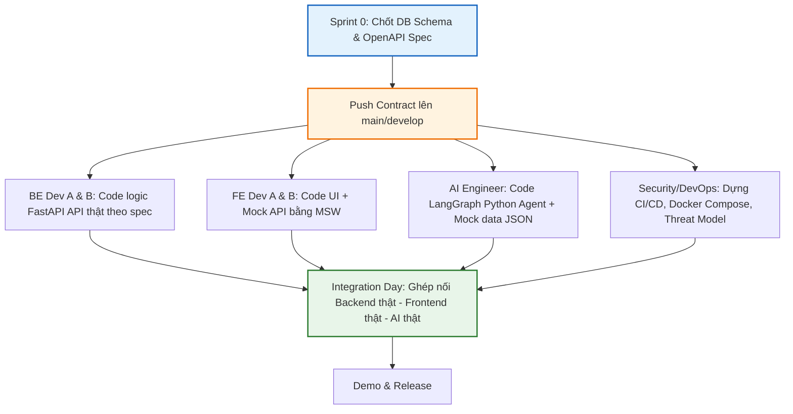
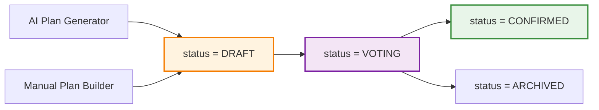
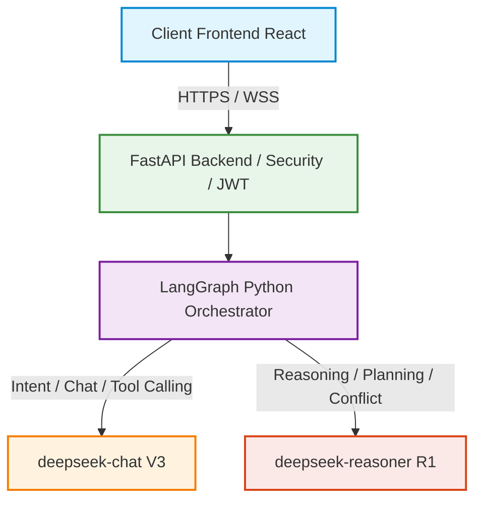

# Hướng Dẫn Vận Hành & Luồng Hoạt Động (Project Explanation)

Tài liệu này giải thích chi tiết luồng hoạt động (flows), cách thức phối hợp làm việc song song (workways), kiến trúc hệ thống Python FastAPI và cách các AI Agents (LangGraph Python) sử dụng DeepSeek API kết nối với hệ thống Core.

Hệ thống hỗ trợ **mọi hoạt động nhóm** — không chỉ du lịch mà còn đi ăn, chọn quán, chỗ chơi, tham quan, cafe/hangout và các sự kiện tùy chỉnh.

---

## 1. Bản Đồ Tài Liệu (Documentation Directory Map)

- **Quy trình làm việc song song:** [contract-first-workflow.md](docs/01-workflow/contract-first-workflow.md) (Quyết định cách 6 người code cùng lúc không bị block).
- **Phân vai trò thành viên:** [team-roles.md](docs/00-overview/team-roles.md) (RACI matrix và phân rã task cụ thể).
- **Tổng quan công nghệ:** [tech-stack.md](docs/00-overview/tech-stack.md) (React, Python FastAPI, SQLAlchemy/SQLModel, Redis, DeepSeek API).
- **Kiến trúc hệ thống:** [system-architecture.md](docs/03-architecture/system-architecture.md) (Sơ đồ tổng quát BE-FE-DB-AI).
- **Kiến trúc AI Agent:** [ai-agent-architecture.md](docs/03-architecture/ai-agent-architecture.md) (LangGraph Python, state machine, các sub-agents).
- **Bảo mật hệ thống:** [security-guidelines.md](docs/05-security/security-guidelines.md) (Sanitize input, validate Pydantic output, rate limiting).
- **Kế hoạch sprint & task:** [task-board.md](docs/04-tasks/task-board.md) (Lộ trình 4 sprint song song).

---

## 2. Luồng Phát Triển Phần Mềm (Software Development Flow)
Dự án áp dụng mô hình **Contract-First Development** để 6 người (2 BE, 2 FE, 1 AI, 1 Security/DevOps) có thể chạy song song từ ngày đầu tiên mà không bị block nhau:

### Các bước hoạt động cụ thể:
1. **Sprint 0 (1-2 ngày đầu):** Cả nhóm thảo luận chốt DB Schema (SQLAlchemy/SQLModel) và OpenAPI Spec (FastAPI tự động sinh ra ở `/docs`).
2. **Thiết lập Mock:** 
   - Backend Dev A dựng bộ khung APIRouter rỗng chỉ có Signature (trả về status code `501 Not Implemented` hoặc mock JSON tạm).
   - Frontend Dev dùng **Mock Service Worker (MSW)** giả lập API response đúng cấu trúc đã chốt để dựng UI.
   - AI Engineer định nghĩa định dạng Pydantic schema của các Agent và sử dụng dữ liệu giả lập (`fixtures/mock_places.json`) để test đồ thị LangGraph Python.
3. **Integration Day (Cuối mỗi Sprint):** Tắt toàn bộ mock, trỏ URL API Frontend về Backend Staging, kết nối AI Agent với database thật để kiểm thử toàn diện luồng nghiệp vụ.

---

## 3. Luồng Nghiệp Vụ Ứng Dụng (Application Core Flows)

Ứng dụng giúp nhóm bạn lên kế hoạch hoạt động chung (du lịch, ăn uống, vui chơi, tham quan, cafe...) với sự hỗ trợ của hệ thống AI Multi-Agent. Dưới đây là luồng đi của dữ liệu cho từng loại sự kiện:

### Bước 1: Tạo Event & Mời Thành Viên (User Flow — chung cho mọi EventType)
1. **User A (Chủ phòng - Owner)** đăng nhập qua Google OAuth2 -> Tạo một **Event**, chọn loại sự kiện:
   - `TRAVEL` — Du lịch (ví dụ: *"Du hí Đà Lạt 3 ngày 2 đêm"*)
   - `DINING` — Đi ăn (ví dụ: *"Tối nay ăn gì?"*)
   - `ENTERTAINMENT` — Đi chơi (ví dụ: *"Cuối tuần đi đâu chơi?"*)
   - `SIGHTSEEING` — Tham quan (ví dụ: *"Cuối tuần tham quan Sài Gòn"*)
   - `HANGOUT` — Cafe/gặp mặt (ví dụ: *"Cafe chiều thứ 7"*)
   - `CUSTOM` — Tùy chỉnh (ví dụ: *"Teambuilding công ty"*, *"Sinh nhật Hùng"*)
2. Owner lấy link mời thành viên và gửi cho **User B, C (Members)**. Hệ thống tạo `Invitation` (Pending → Accepted/Declined).
3. Các thành viên truy cập link, join vào Event. Lúc này DB tạo các bản ghi tương ứng trong bảng `event_members` với role tương ứng.

---

### Ví dụ 1: Luồng Du Lịch (TRAVEL Event)
1. Owner hoặc Member gửi yêu cầu vào màn hình chat: *"Thiết kế lịch trình nghỉ dưỡng nhẹ nhàng cho nhóm 3 người ở Đà Lạt, thích ngắm cảnh, ăn uống, ngân sách khoảng 5 triệu/người."*
2. **AI Orchestrator** nhận `eventType = TRAVEL` -> kích hoạt luồng TRAVEL trong LangGraph Python:
   - **Location Agent (9.2)** tìm các điểm phù hợp -> gọi Google Places API (category: `ATTRACTION`, `RESTAURANT`, `HOTEL`). Kết quả cache qua Redis.
   - **Research Agent (9.5)** tổng hợp thông tin, review chi tiết.
   - **Plan Agent (9.3)** (dùng `deepseek-reasoner`) sắp xếp lịch trình tối ưu theo ngày.
   - **Cost Agent (9.9)** tính toán chi phí dự kiến bằng Python code.
   - **Booking Agent (9.1)** gợi ý link đặt phòng khách sạn, vé xe.
3. Kết quả gửi về dạng **Draft Plan** → cả nhóm xem, vote, confirm.

### Ví dụ 2: Luồng Đi Ăn (DINING Event)
1. User A tạo Event loại `DINING`: *"Tối thứ 7 ăn gì đây?"*, mời 4 người bạn.
2. User A nhờ AI gợi ý: *"Tìm quán ăn ngon khu Quận 1, nhóm 5 người, ngân sách 200k/người, thích đồ Nhật"*.
3. **Orchestrator** nhận `eventType = DINING` → kích hoạt luồng DINING:
   - **Location Agent** (filter: `RESTAURANT`, cuisine: Nhật) → trả về 5 quán phù hợp.
   - **Research Agent** → tổng hợp review, **gợi ý menu/món hay** của từng quán, giá trung bình.
   - **Plan Agent** → chọn top 2-3 quán, kèm giờ đề xuất và link đặt bàn.
4. Kết quả trả về dạng Draft Plan → Cả nhóm **vote chọn quán**.
5. Owner confirm → Hệ thống gửi notification kèm thông tin quán đã chốt.

### Ví dụ 3: Luồng Đi Chơi (ENTERTAINMENT Event)
1. User tạo Event loại `ENTERTAINMENT`: *"Cuối tuần đi đâu chơi?"*, mời nhóm.
2. AI gợi ý: *"Tìm chỗ chơi cho nhóm 6 người, thích hoạt động vận động, khu Quận 7"*.
3. **Orchestrator** nhận `eventType = ENTERTAINMENT` → kích hoạt:
   - **Location Agent** (filter: `ENTERTAINMENT`) → bowling, escape room, paintball, arcade...
   - **Research Agent** → giá vé, khung giờ, review, tips.
   - **Plan Agent** → sắp xếp lịch (VD: 14h bowling → 17h ăn tối gần đó).
   - **Booking Agent** → link đặt chỗ.
4. Vote → Confirm → Notification + Export nếu cần.

### Ví dụ 4: Luồng Tham Quan (SIGHTSEEING Event)
1. User tạo Event loại `SIGHTSEEING`: *"Cuối tuần tham quan Sài Gòn"*.
2. AI gợi ý các điểm check-in, bảo tàng, di tích lịch sử.
3. **Orchestrator** nhận `eventType = SIGHTSEEING` → kích hoạt:
   - **Location Agent** (filter: `ATTRACTION`) → bảo tàng, triển lãm, di tích.
   - **Research Agent** → giờ mở cửa, giá vé, tips tham quan.
   - **Plan Agent** → tối ưu tuyến đường đi trong ngày.
   - **Cost Agent** → tổng chi phí vé + ăn uống.
4. Vote → Confirm → Notification.

### Ví dụ 5: Luồng Cafe/Hangout (HANGOUT Event)
1. User tạo Event loại `HANGOUT`: *"Cafe chiều thứ 7"*.
2. AI gợi ý quán cafe khu vực yêu cầu, so sánh vibe/giá.
3. Luồng ngắn: Location Agent → Plan Agent (chọn quán + giờ) → Vote → Confirm.

---

## 3.5. Luồng Plan Thủ Công (Không Dùng AI)

> [!NOTE]
> **Bất kỳ member nào** cũng có thể tự tạo plan thủ công mà không cần qua AI. Plan thủ công được đối xử **hoàn toàn bình đẳng** với plan AI — có thể export PDF, xem trên bản đồ, chia chi phí, nhận nhắc nhở.

### Quy tắc Vote chung:
1. **Mọi Plan** (dù AI hay thủ công) khi tạo đều có `status = DRAFT`.
2. Người tạo bấm "Gửi cho nhóm vote" → `VOTING` → notification tới tất cả member.
3. Member vote + comment góp ý.
4. **Chỉ Owner** mới có quyền xác nhận → `CONFIRMED`.
5. Event chỉ có **1 người** → cho phép skip voting, confirm trực tiếp.

---

## 4. Tích Hợp DeepSeek API Trong Kiến Trúc AI Agent (Python Native)

Vì Backend sử dụng Python FastAPI, hệ thống tích hợp trực tiếp **LangGraph Python (`langgraph`)** và DeepSeek API trong cùng một codebase Python mượt mà:

- **`deepseek-chat` (DeepSeek-V3):**
  - **Tác vụ:** Chat tự do với người dùng, **phân loại EventType** và intent, gọi công cụ (Function Calling) để lấy thông tin thời tiết, địa điểm, nhà hàng, chỗ chơi, trích xuất dữ liệu thô.
  - **Ưu điểm:** Tốc độ phản hồi cực nhanh, hỗ trợ SSE/WebSocket streaming mượt mà, giá thành siêu rẻ.
- **`deepseek-reasoner` (DeepSeek-R1):**
  - **Tác vụ:** Lên lịch trình tối ưu (sắp xếp thứ tự đi, thời gian giữa các điểm dừng), cân đối ngân sách, **gợi ý menu/món ăn phù hợp nhóm** (DINING), **chọn hoạt động phù hợp số người** (ENTERTAINMENT), phân tích và giải quyết xung đột ý kiến (Conflict Resolver).
  - **Ưu điểm:** Khả năng suy nghĩ sâu (reasoning tokens), tư duy logic chặt chẽ giúp giải quyết các bài toán tối ưu lộ trình và dung hòa ý kiến nhóm tốt hơn hẳn LLM thông thường.

---

## 5. Quy Tắc Bảo Mật Và Chi Phí Trong Doanh Nghiệp (Enterprise Standards)

1. **Bảo Mật Đầu Vào:** Mọi câu lệnh chat từ user đều được validate độ dài và lọc mã độc (Sanitization) qua Pydantic & bleach trước khi truyền vào prompt của DeepSeek.
2. **Bảo Mật Đầu Out:** Dữ liệu trả về từ DeepSeek (như danh sách địa điểm dạng JSON) bắt buộc phải đi qua parser sử dụng **Pydantic v2** để xác thực kiểu dữ liệu. Nếu JSON lỗi cấu trúc, hệ thống sẽ tự động bắt lỗi thay vì hiển thị trực tiếp lên UI làm crash ứng dụng.
3. **Quản Lý Token & Chi Phí:** Mọi lượt gọi DeepSeek API đều được Logger ghi lại (số input/output token, thời gian xử lý, ID người dùng) và lưu vào bảng `agent_logs`. Admin Dashboard sẽ dựa vào đây để cảnh báo hoặc thiết lập Rate Limit/giới hạn quota theo ngày cho từng user.
